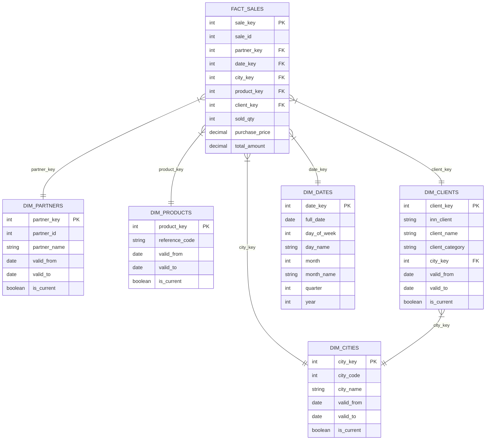
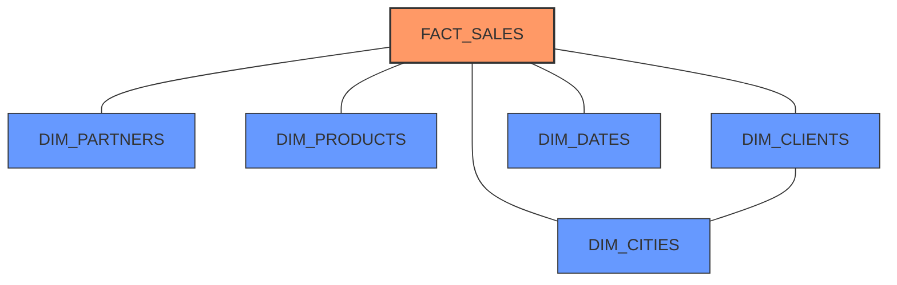

# Визуальная схема звезда для хранилища данных

## Диаграмма схемы звезда

## Описание схемы

Данная диаграмма представляет схему звезда для хранилища данных о продажах. В центре находится таблица фактов **FACT_SALES**, которая связана с пятью таблицами измерений:

1. **DIM_PARTNERS** - измерение поставщиков
2. **DIM_CITIES** - измерение городов
3. **DIM_PRODUCTS** - измерение товаров
4. **DIM_CLIENTS** - измерение клиентов
5. **DIM_DATES** - измерение дат

Обратите внимание на следующие особенности:

- Таблица фактов связана с каждой таблицей измерений через соответствующий внешний ключ
- Таблица измерений клиентов (DIM_CLIENTS) также связана с таблицей измерений городов (DIM_CITIES), что является примером "снежинки" внутри схемы звезда
- Каждая таблица измерений имеет суррогатный ключ (PK) и бизнес-ключ
- Таблицы измерений содержат поля для отслеживания изменений (valid_from, valid_to, is_current)
- Таблица фактов содержит метрики: количество проданных товаров (sold_qty), цена покупки (purchase_price) и общая сумма (total_amount)

## Альтернативное представление

Это упрощенное представление наглядно показывает структуру "звезды", где центральная таблица фактов связана со всеми таблицами измерений.