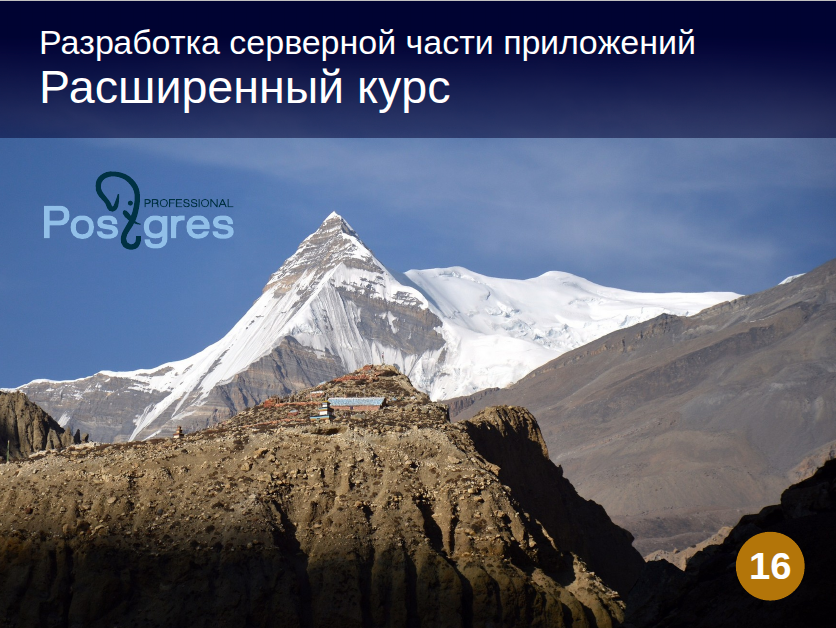
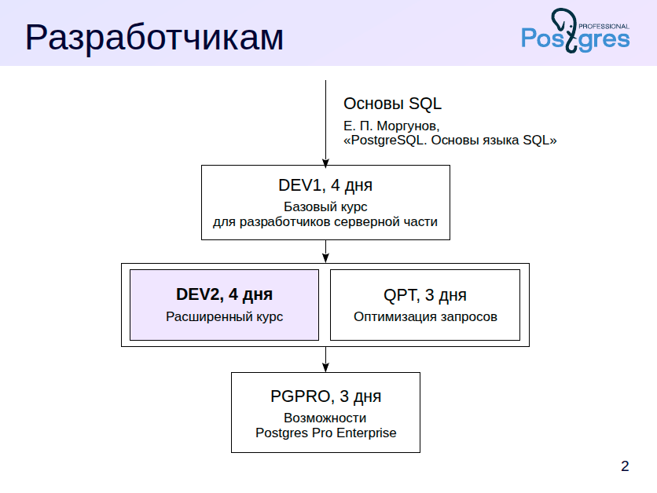
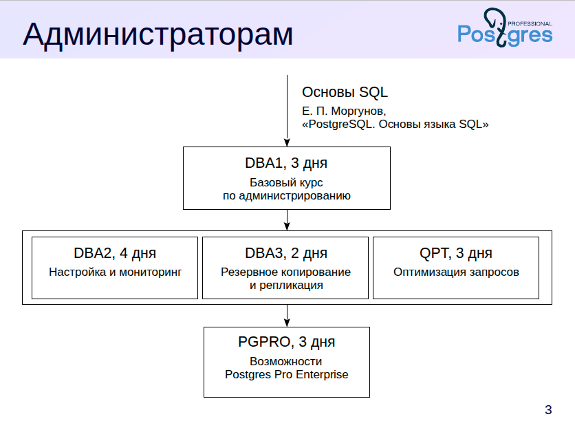
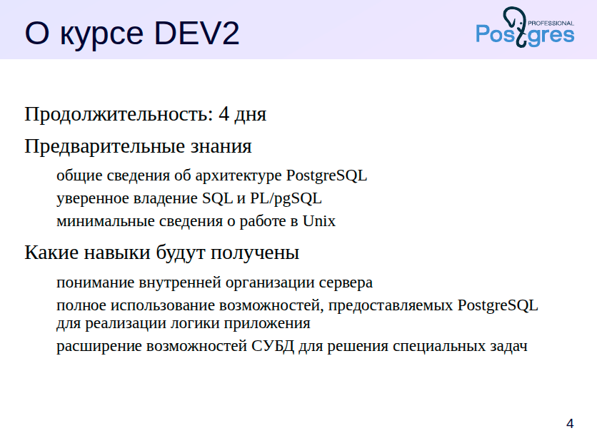
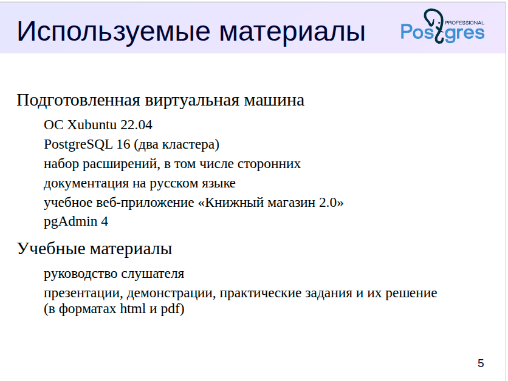
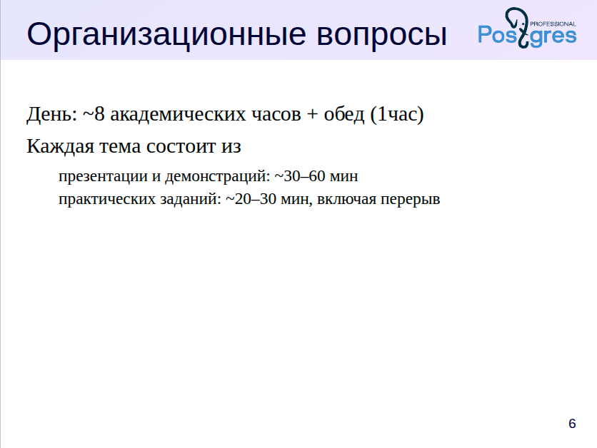
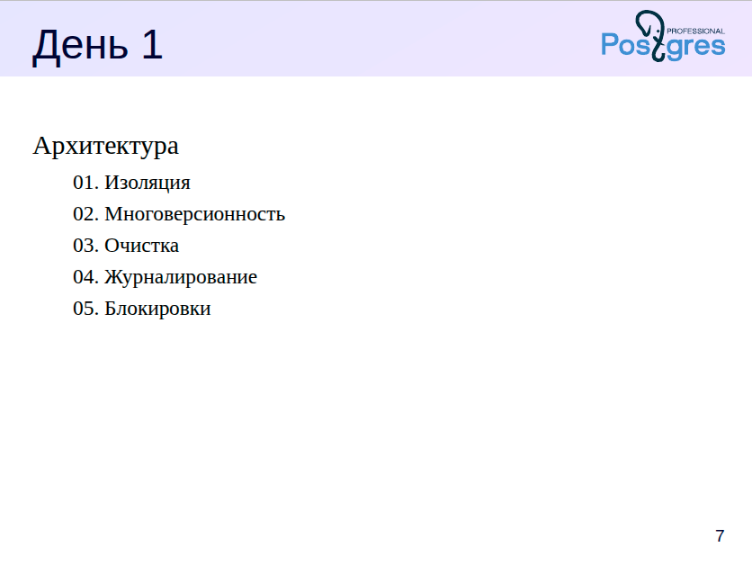
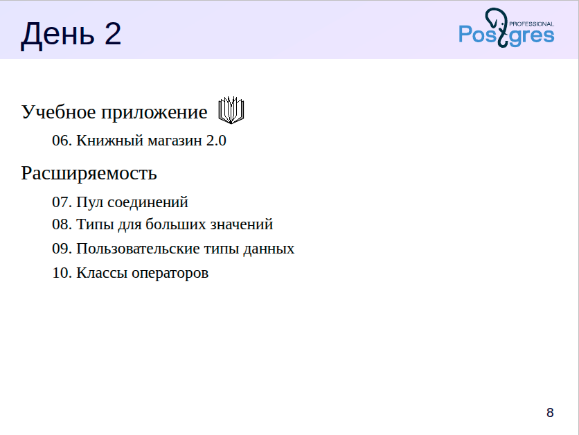
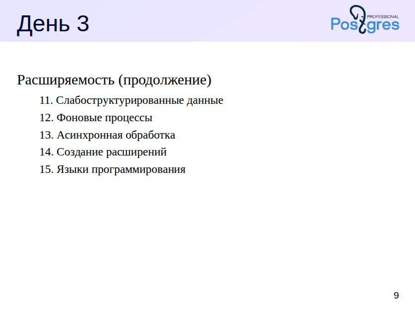
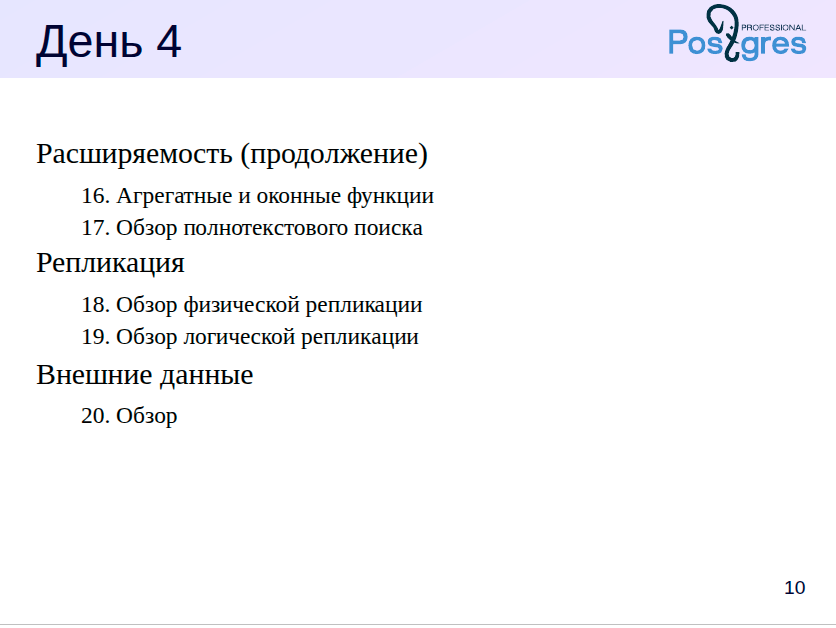

### Введение в курс для разработчиков серверной части приложений

Для разработчиков серверной части мы предлагаем несколько специализированных курсов. Однако перед их прохождением крайне важно обладать базовыми знаниями языка **SQL**.

Обратите внимание, что в нашей учебной линейке **нет отдельного курса по SQL**, поэтому рекомендуем заранее освоить основы с помощью внешних ресурсов. Один из надёжных и доступных вариантов — книга Евгения Моргунова *«PostgreSQL. Основы языка SQL»*, доступная по ссылке:
📘 [https://postgrespro.ru/education/books/sqlprimer](https://postgrespro.ru/education/books/sqlprimer)

---

### Основные курсы для разработчиков

#### **DEV1** — Базовый курс серверной разработки

Этот курс является стартовой точкой для разработчиков. Он включает:

* общие сведения об архитектуре PostgreSQL,
* обзор ключевых объектов базы данных,
* программирование на стороне сервера с использованием SQL и PL/pgSQL,
* работу с основными типами данных, включая составные типы и массивы,
* основы взаимодействия с клиентской частью.

#### **DEV2** — Продвинутый курс по серверной разработке

Курс **DEV2** продолжает и углубляет темы, начатые в DEV1. Мы более детально изучаем сложные аспекты серверного программирования и архитектурные возможности PostgreSQL.

#### **QPT** — Производительность и оптимизация запросов

На этом курсе мы:

* изучаем механизмы планирования и выполнения запросов,
* разбираем параметры экземпляра, влияющие на производительность,
* учимся находить и оптимизировать проблемные запросы.

#### **PGPRO** — Расширенные возможности Postgres Pro

Этот курс посвящён особенностям и дополнительным возможностям редакции **Postgres Pro Enterprise**. Он подойдёт тем, кто работает с корпоративной версией СУБД и хочет задействовать её потенциал в полной мере.
Подробнее:
📚 [https://postgrespro.ru/education/courses](https://postgrespro.ru/education/courses)

---

### Обучающие курсы для администраторов PostgreSQL

Для администраторов PostgreSQL у нас предусмотрен ряд последовательных курсов, каждый из которых раскрывает отдельные аспекты управления сервером и инфраструктурой базы данных.

---

#### **DBA1** — Базовый курс по администрированию

Курс предназначен для начального освоения PostgreSQL с административной точки зрения. В нём рассматриваются:

* архитектура СУБД,
* установка и первичная настройка сервера,
* базовые задачи администрирования,
* управление доступом пользователей,
* обзор механизмов резервного копирования и репликации.

---

#### **DBA2** — Продвинутое администрирование

Продолжение курса DBA1. Основные темы:

* тонкая настройка конфигурационных параметров на основе понимания внутренней архитектуры PostgreSQL,
* мониторинг сервера и итеративная настройка по результатам анализа,
* параметры локализации,
* управление расширениями,
* процедура обновления версии сервера.

---

#### **DBA3** — Резервное копирование и репликация

Третий курс в линейке посвящён следующим вопросам:

* построение стратегий резервного копирования,
* настройка физической и логической репликации,
* различные сценарии использования репликации,
* основы проектирования высокодоступных и масштабируемых кластеров.

---

#### **QPT** и **PGPRO**

Эти два курса являются **общими** для разработчиков и администраторов:

* **QPT** — фокусируется на производительности запросов и настройке экземпляра;
* **PGPRO** — посвящён возможностям корпоративной версии Postgres Pro Enterprise.

---

### Для кого подойдут эти курсы?

Курсы по администрированию полезны не только системным администраторам, но и разработчикам, которые:

* хотят глубже разобраться во внутреннем устройстве PostgreSQL,
* работают в командах, где нет выделенной роли DBA (администратора баз данных).

---

**Основная идея курса** — не просто познакомить с базовыми возможностями PostgreSQL, а показать его как *расширяемую платформу*. Мы акцентируем внимание на том, что PostgreSQL — это не только СУБД, но и основа для создания специализированных решений:
благодаря встроенным языкам программирования и открытой архитектуре вы можете дополнять поведение сервера собственным кодом, расширяя его функциональность под задачи любой сложности.

В этом курсе мы уделяем особое внимание теме расширяемости PostgreSQL. Мы рассмотрим большое количество расширений — как встроенных, так и сторонних. Это позволяет на практике показать, насколько гибкой может быть СУБД, и как легко её можно адаптировать под специфические задачи.

Все необходимые расширения уже предустановлены в виртуальной машине, которую мы подготовили для курса. Если вы проходите курс самостоятельно, начните со знакомства с **Руководством слушателя** — в нём объясняется, где взять виртуальную машину, как её развернуть и где найти все сопутствующие материалы.

Учебные материалы размещены на официальной странице курса:
👉 [https://postgrespro.ru/education/courses/DEV2](https://postgrespro.ru/education/courses/DEV2)

Практика — ключевая часть обучения. Обязательно сначала попытайтесь выполнить практическое задание самостоятельно. Даже если всё получилось, не пропускайте предложенное решение — там часто содержатся дополнительные комментарии, приёмы или нюансы, которые не включены в презентации и демонстрации.

Все материалы представлены в двух форматах:

* **HTML** — удобно работать онлайн, легко копировать код и текст;
* **PDF** — удобен для печати и офлайн-работы.

---

**В первый день занятий** мы сосредоточимся на теоретической подготовке. Мы вернёмся к темам, знакомым по курсу DEV1, но рассмотрим их на более глубоком уровне, закладывая прочную основу для последующих практических тем.

**Со второго дня** курс переходит к прикладным аспектам серверной разработки. Мы будем работать с учебным приложением **«Книжный магазин 2.0»**, чтобы продемонстрировать, как расширяемость PostgreSQL применяется на практике. Темы второго дня включают:

* Пул соединений
* Работа с типами для больших значений
* Пользовательские типы данных
* Классы операторов

Каждая тема сопровождается двумя наборами заданий:

* Задания по приложению «Книжный магазин 2.0» — они отмечены значком книги,
* Дополнительные задания для более глубокого погружения.

Обратите внимание, что времени на выполнение всех упражнений не хватит — на практику отводится около 30 минут. Поэтому рекомендуем обязательно возвращаться к дополнительным заданиям при самостоятельной работе — они помогут закрепить материал и выйти за рамки базовых требований.

В последних трех темах используется второй кластер PostgreSQL, установленный в виртуальной машине курса.