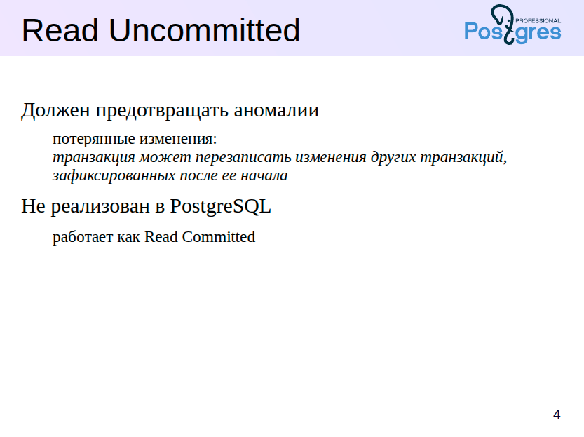

Давайте разберёмся, что такое **транзакция**.

Представьте себе: приложение выполняет несколько операций с базой данных — и все они вместе образуют транзакцию. Цель этих операций — перевести базу из одного **корректного состояния** в другое, тоже корректное.

Что значит «корректное»? Это состояние, которое:

* соблюдает **ограничения целостности**, заданные в самой базе,
* и при этом **логически соответствует** тому, как должна работать ваша бизнес-логика.

Но есть важные условия:

1. Все операции внутри транзакции должны выполниться **целиком**, либо **не выполниться вообще** — это называется **атомарность**.
2. Они не должны мешать другим транзакциям — и наоборот. Это **изоляция**.

Если изоляция идеальна, то каждую транзакцию можно воспринимать как будто она выполняется одна, без всякого параллельного шума. Приложение при этом работает стабильно, предсказуемо, и без сюрпризов.

Но вот в чём загвоздка: полная изоляция — вещь дорогая. С точки зрения производительности, это как если бы вы запускали в автобус по одному пассажиру, чтобы они не мешали друг другу.

На практике приходится искать компромисс: ослабляем изоляцию ради более быстрой работы. Но тогда появляется риск столкнуться с **аномалиями** — ситуациями, когда результат транзакции может оказаться **некорректным**, если параллельно выполнялись другие транзакции. Это может произойти, например, из-за того, что операции из разных транзакций начали **чередоваться** друг с другом.

Поэтому важно не просто знать, что изоляция бывает, а **понимать её уровни и последствия**, особенно в конкурентной среде.

Ну а про четвёртое свойство ACID — **долговечность** — мы поговорим чуть позже, когда дойдём до темы **журналирования**.

---

Если хочешь, могу сделать аналогичный стиль для объяснения всех четырёх ACID-свойств или уровней изоляции.





**Read Uncommitted — уровень изоляции, которого… нет в PostgreSQL**

Давайте поговорим про самый слабый уровень изоляции — **Read Uncommitted**. Как видно из названия, на этом уровне транзакции могут видеть даже **незафиксированные** изменения других транзакций. Это как заглянуть в чужой черновик до того, как он успел нажать "сохранить".

Стандарт SQL допускает использование этого уровня и требует, чтобы хотя бы **одна аномалия** при этом предотвращалась — **потерянные обновления** (*lost updates*). Что это такое?
Представим ситуацию:

* Транзакция T1 читает строки.
* Затем T2 меняет эти же строки и **успешно фиксирует изменения**.
* А потом T1 записывает свои изменения — и **затирает то, что сделала T2**.
  Вот это и есть потерянные изменения — когда одно изменение "съедает" другое.

Такой уровень изоляции вводился ради **максимальной производительности**, но в PostgreSQL решили:

> «Зачем нам слабый уровень, если мы можем без особых потерь работать на более строгом?»

В итоге:

* **Read Uncommitted в PostgreSQL не реализован.**
* На практике он работает как **Read Committed**.
* А потому останавливаться на нём подробно мы не будем — просто знайте, что он существует в стандарте, но **не нужен нам в PostgreSQL-вселенной**.


# Особенности уровня изоляции Read Committed


## Иерархия уровней изоляции

- Каждый следующий уровень изоляции строже предыдущего.
- Уровень **Read Committed** — базовый и самый распространённый по умолчанию в PostgreSQL.

---

## Что предотвращает Read Committed?

- **Грязное чтение (dirty read)** — транзакция T1 **не увидит** изменения, сделанные, но еще не зафиксированные транзакцией T2.
- Это означает, что если транзакция T2 сделает ROLLBACK, данные, которые могла прочитать T1, «никогда не существовали».

---

## Какие проблемы остаются?

- На уровне Read Committed допускаются другие аномалии и нестабильности.
- Разработчик должен быть готов к этим ситуациям и **при необходимости применять явные блокировки**.

---

## Почему именно Read Committed?

- PostgreSQL использует этот уровень по умолчанию.
- Это компромисс между:
  - строгой изоляцией данных,
  - и производительностью (эффективностью работы СУБД).

---

## Важное замечание

- На уровне Read Committed **возможна потеря изменений** при конкурирующих обновлениях.
- Мы это подробно покажем на практике в демонстрации.


*Итого: понимание ограничений Read Committed — ключ к правильному проектированию транзакций и предотвращению ошибок.*


Вот полный текст с кодом в формате Markdown, адаптированный для лектора, без потерь информации:

````markdown
# Управление уровнем изоляции

Для демонстрации мы будем использовать отдельную базу данных для каждой темы.

```sql
=> CREATE DATABASE arch_isolation;
CREATE DATABASE
=> \c arch_isolation
You are now connected to database "arch_isolation" as user "student".
````

Уровни изоляции посмотрим на примере с таблицей, представляющей состояние светофора:

```sql
=> CREATE TABLE lights(
  id integer GENERATED ALWAYS AS IDENTITY,
  lamp text,
  state text
);
CREATE TABLE
```

Это будет пешеходный светофор с двумя лампочками:

```sql
=> INSERT INTO lights(lamp,state) VALUES
    ('red', 'on'), ('green', 'off');
INSERT 0 2
=> SELECT * FROM lights ORDER BY id;
 id | lamp  | state 
----+-------+-------
  1 | red   | on
  2 | green | off
(2 rows)
```

---

## Установка уровня изоляции

Один способ — команда `SET TRANSACTION`, выполненная в начале транзакции:

```sql
=> BEGIN;
BEGIN
=> SET TRANSACTION ISOLATION LEVEL READ COMMITTED;
SET
```

Проверить текущий уровень можно командой:

```sql
=> SHOW transaction_isolation;
 transaction_isolation 
-----------------------
 read committed
(1 row)
```

```sql
=> COMMIT;
COMMIT
```

Можно указать уровень изоляции прямо в команде `BEGIN`:

```sql
=> BEGIN ISOLATION LEVEL READ COMMITTED;
BEGIN
=> COMMIT;
COMMIT
```

По умолчанию используется уровень Read Committed:

```sql
=> SHOW default_transaction_isolation;
 default_transaction_isolation 
-------------------------------
 read committed
(1 row)
```

Если параметр не менялся, уровень можно не указывать явно.

```sql
=> BEGIN;
BEGIN
=> SHOW transaction_isolation;
 transaction_isolation 
-----------------------
 read committed
(1 row)
=> COMMIT;
COMMIT
```

---

## Read Committed и грязное чтение

Попробуем прочитать «грязные» данные. В первой транзакции гасим красный свет:

```sql
=> BEGIN;
BEGIN
=> UPDATE lights SET state = 'off' WHERE lamp = 'red';
UPDATE 1
```

Начинаем второй сеанс:

```bash
student$ psql arch_isolation
```

В нем откроем еще одну транзакцию с тем же уровнем Read Committed.

```sql
|=> BEGIN;
|BEGIN
|=> SELECT * FROM lights ORDER BY id;
| id | lamp  | state 
|----+-------+-------
|  1 | red   | on
|  2 | green | off
|(2 rows)
```

Вторая транзакция не видит незафиксированных изменений.

Отменим изменение.

```sql
=> ROLLBACK;
ROLLBACK
|=> ROLLBACK;
|ROLLBACK
```

---

## Read Committed и чтение зафиксированных изменений

Проверим поведение при фиксации изменений.

```sql
=> BEGIN;
BEGIN
=> UPDATE lights SET state = 'off' WHERE lamp = 'red';
UPDATE 1
```

Вторая транзакция:

```sql
| => BEGIN;
| BEGIN
| => SELECT * FROM lights ORDER BY id;
|  id | lamp  | state 
| ----+-------+-------
|   1 | red   | on
|   2 | green | off
| (2 rows)
```

Пока изменений не видно.

```sql
=> COMMIT;
COMMIT
```

Теперь изменения доступны:

```sql
| => SELECT * FROM lights ORDER BY id;
|  id | lamp  | state 
| ----+-------+-------
|   1 | red   | off
|   2 | green | off
| (2 rows)
|
| => COMMIT;
| COMMIT
```

Итак, в режиме Read Committed операторы одной транзакции видят зафиксированные изменения других транзакций.

---

## Поведение внутри одного оператора

Один и тот же запрос в транзакции может выдавать разные результаты, если он выполняется несколько раз.

Можно ли увидеть изменения, зафиксированные во время выполнения одного оператора? Проверим.

Все лампочки погашены. Запускаем долгий запрос и, пока он работает, включаем свет во втором сеансе:

```sql
=> SELECT *, pg_sleep(2) FROM lights ORDER BY id;
| => UPDATE lights SET state = 'on';
| UPDATE 2
```

Результат долгого запроса:

```
 id | lamp  | state | pg_sleep 
----+-------+-------+----------
  1 | red   | off   | 
  2 | green | off   | 
(2 rows)
```

Вывод: если во время выполнения оператора другая транзакция зафиксировала изменения, они **не видны** текущему оператору. Оператор видит данные в состоянии на момент начала его выполнения.

---

## Особенность функций с VOLATILE

Если в запросе вызывается функция с категорией изменчивости `VOLATILE`, выполняющая собственный запрос, то внутри функции данные могут быть не согласованы с основным запросом.

```sql
=> CREATE FUNCTION get_state(lamp text) RETURNS text
LANGUAGE sql VOLATILE
RETURN (SELECT l.state FROM lights l WHERE l.lamp = get_state.lamp);
CREATE FUNCTION
```

Повторим эксперимент с функцией:

```sql
=> SELECT *, get_state(lamp), pg_sleep(2) FROM lights ORDER BY id;
| => UPDATE lights SET state = 'off';
| UPDATE 2
```

Результат:

```
 id | lamp  | state | get_state | pg_sleep 
----+-------+-------+-----------+----------
  1 | red   | on    | on        | 
  2 | green | on    | off       | 
(2 rows)
```

---

## Решение: функция с категорией STABLE

Объявим функцию с категорией изменчивости `STABLE`:

```sql
=> ALTER FUNCTION get_state STABLE;
ALTER FUNCTION
```

Повторим запрос:

```sql
=> SELECT *, get_state(lamp), pg_sleep(2) FROM lights ORDER BY id;
=> UPDATE lights SET state = 'on';
UPDATE 2
```

Результат:

```
 id | lamp  | state | get_state | pg_sleep 
----+-------+-------+-----------+----------
  1 | red   | off   | off       | 
  2 | green | off   | off       | 
(2 rows)
```

---

**Вывод:** внимательно следите за категорией изменчивости функций при уровне изоляции Read Committed. При значениях по умолчанию можно получить несогласованные данные.

---

## Read Committed и потерянные изменения

Что происходит при попытке изменить одну и ту же строку двумя транзакциями?

Сейчас обе лампочки включены.

Первая транзакция выключает красную лампочку, но не завершается:

```sql
=> BEGIN;
BEGIN
=> UPDATE lights SET state = 'off' WHERE lamp = 'red';
UPDATE 1
```

Вторая транзакция:

```sql
| => BEGIN;
| BEGIN
| => SELECT * FROM lights;
|  id | lamp  | state 
| ----+-------+-------
|   2 | green | on
|   1 | red   | on
| (2 rows)
```

Меняет состояние каждой лампочки:

```sql
=> UPDATE lights
SET state = CASE WHEN state = 'on' THEN 'off' ELSE 'on' END;
```

Команда зависает, ожидая завершения первой транзакции.

Первая транзакция коммитится:

```sql
=> COMMIT;
COMMIT
```

Вторая транзакция продолжает:

```sql
| UPDATE 2
```

Проверяем результат после завершения обеих транзакций:

```sql
=> COMMIT;
COMMIT
=> SELECT * FROM lights;
 id | lamp  | state 
----+-------+-------
  2 | green | off
  1 | red   | on
(2 rows)
```

---

### Почему так произошло?

* Команда `UPDATE` во второй транзакции блокирует строки по очереди.
* Сначала меняет состояние зеленой лампочки.
* Затем ждет снятия блокировки с красной лампочки первой транзакцией.
* При этом команда не должна видеть изменений, сделанных после начала своей транзакции.
* Но она также не должна потерять изменения других транзакций.
* Поэтому после снятия блокировки она перечитывает строку.
* В итоге первая транзакция выключила красную лампочку, а вторая снова включила её.

---

### Итог

* Вторая транзакция успешно выполнилась, но видела несогласованные данные (частично на момент начала, частично — позже).
* Если изменение состоит из нескольких команд, то обновление может быть потеряно.

---

## Демонстрация потерянных изменений

Первая транзакция переводит красную лампочку в мигающий режим, блокируя строку:

```sql
=> BEGIN;
BEGIN
=> UPDATE lights SET state = 'blink' WHERE lamp = 'red';
UPDATE 1
```

Вторая транзакция:

```sql
=> BEGIN;
BEGIN
=> SELECT state AS old_state FROM lights WHERE lamp = 'red';
 old_state 
-----------
 on
(1 row)
```

Выключает красную лампочку:

```sql
=> \bind off
=> UPDATE lights SET state = $1 WHERE lamp = 'red';
```

Вторая транзакция ждет завершения первой.

Первая транзакция коммитится:

```sql
=> COMMIT;
COMMIT
```

Вторая продолжает:

```sql
UPDATE 1
=> COMMIT;
COMMIT
```

Проверим состояние красной лампочки:

```sql
=> SELECT * FROM lights WHERE lamp = 'red';
 id | lamp | state 
----+------+-------
  1 | red  | off
(1 row)
```

---

### Объяснение

* Вторая транзакция записала свои изменения поверх изменений первой.
* На уровне Read Committed сервер не может предотвратить такую потерю данных.
* Команда `UPDATE` содержит фиксированное значение и не учитывает предыдущее состояние строки.

---

# Итог

На уровне изоляции **Read Committed**:

* Грязное чтение исключено.
* Возможны несогласованные данные и потерянные обновления.
* Требуется осторожность при проектировании транзакций и использовании функций с изменчивостью.
* При необходимости нужно применять явные блокировки для предотвращения проблем.


