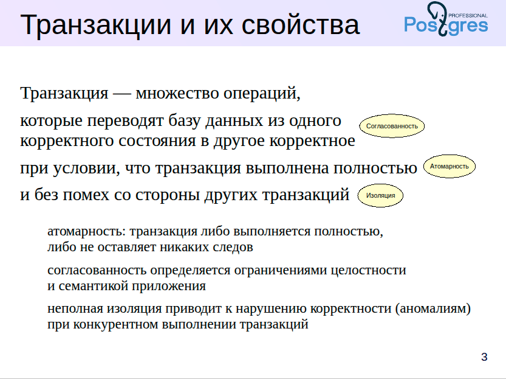
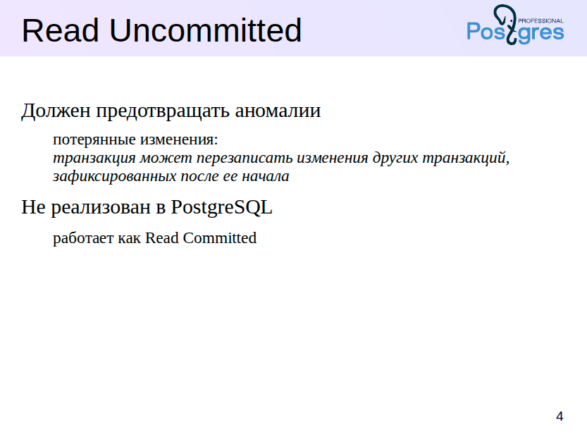
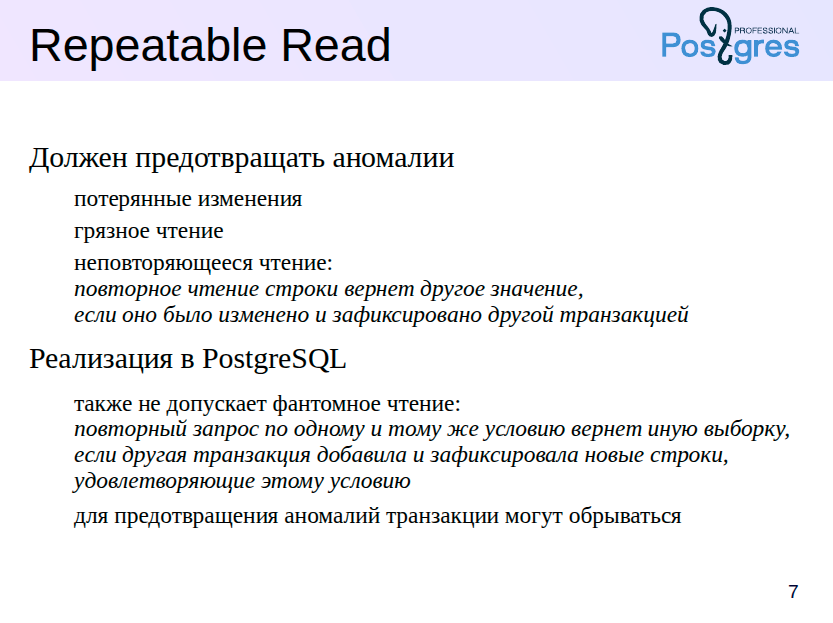
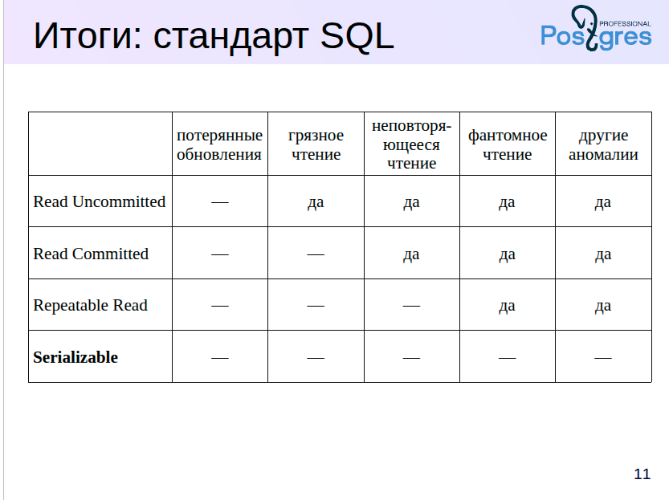
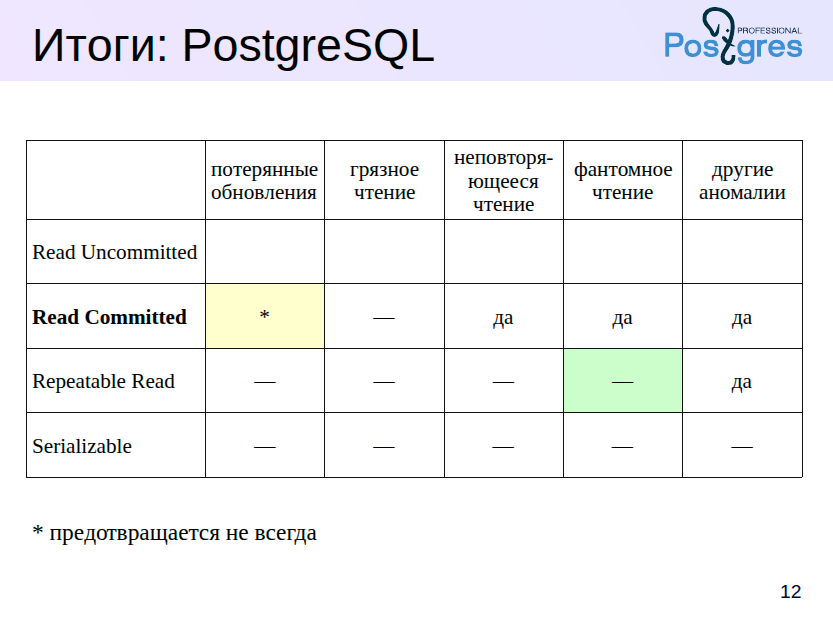
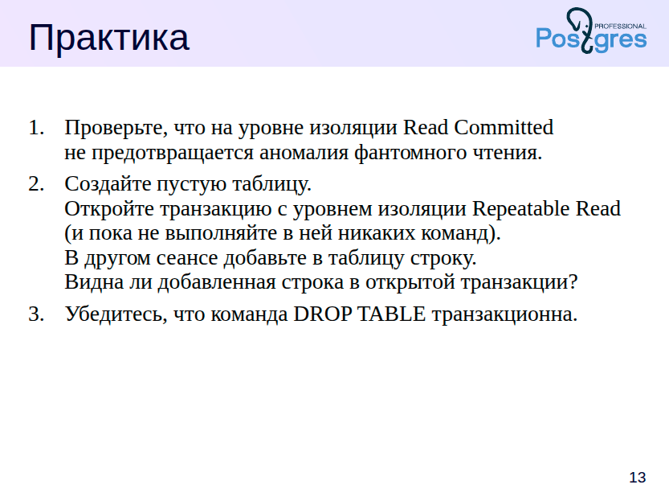

Когда мы говорим о **транзакции**, мы имеем в виду набор операций, которые приложение выполняет над базой данных, чтобы перевести её из одного **корректного состояния** в другое.

Что значит *корректное состояние*? Это состояние, которое удовлетворяет всем **ограничениям целостности** — как тем, что заданы в базе данных, так и тем, что определяются логикой самого приложения.

Чтобы изменения, которые вносит транзакция, считались корректными, важно, чтобы были соблюдены **три свойства**:

* **Атомарность** — либо выполняется вся транзакция целиком, либо не выполняется ничего;
* **Согласованность** — база данных остаётся в корректном состоянии;
* **Изоляция** — транзакции не мешают друг другу.


Рассмотрим принципы **ACID** на простом и понятном примере – **переводе денег с одного банковского счёта на другой**.

---

### 💳 Сценарий:

Клиент переводит **1000 рублей** со счёта А на счёт B.

---

### 🔹 A — *Атомарность*

Операция должна выполниться **целиком или не выполниться вовсе**.
Например, если 1000 рублей списались со счёта А, но из-за сбоя не были зачислены на счёт B — система должна отменить весь перевод.

**Просто: либо оба действия, либо ни одного.**

---

### 🔹 C — *Согласованность*

После выполнения транзакции все ограничения системы должны сохраняться.
Например, **общее количество денег в системе до и после перевода одинаково** — деньги не "пропали" и не "появились из воздуха".

---

### 🔹 I — *Изоляция*

Если в то же самое время выполняется другая транзакция, она **не должна мешать** текущей.
Допустим, клиент B пытается вывести деньги со своего счёта во время зачисления. Система должна обеспечить, чтобы **он не получил доступ к ещё не поступившим деньгам**.

---

### 🔹 D — *Долговечность*

После того как система сообщила, что перевод завершён успешно — **данные сохраняются даже при сбое**.
Даже если сервер "упал", после перезапуска перевод **не исчезнет**.

---


Особенно важно свойство изоляции. В идеале — если бы транзакция выполнялась в полном одиночестве — результат её работы не зависел бы от других параллельных транзакций. Но на практике изоляция часто **ослабляется**, чтобы повысить производительность. Это может привести к так называемым **аномалиям** — ситуациям, когда результат оказывается некорректным именно из-за взаимодействия с другими транзакциями.

Полная изоляция — это дорого и сложно. Поэтому важно **понимать, какие риски мы берём на себя**, снижая уровень изоляции.

О последнем свойстве — **долговечности (durability)** — мы поговорим позже, когда будем обсуждать **журналирование**.





**SQL-стандарт определяет четыре уровня изоляции транзакций**, и каждый из них допускает или предотвращает определённые аномалии при параллельной работе.

**Самый слабый уровень — Read Uncommitted**. Как видно из названия, на этом уровне транзакция может *видеть даже незафиксированные данные других транзакций*. Это может привести к множеству проблем.

Однако, согласно стандарту, даже на этом уровне должна быть предотвращена одна ключевая аномалия — **потерянные изменения** (*lost updates*). Что это значит? Допустим, транзакция T1 начала работать с данными. Параллельно другая транзакция T2 изменила эти же данные и успела их зафиксировать. Если T1 потом "перезапишет" эти данные, не заметив изменений T2 — это и есть потерянное изменение.

Именно эту ситуацию стандарт требует исключать даже на уровне Read Uncommitted.

Но есть важный практический момент:
**PostgreSQL вообще не реализует уровень Read Uncommitted**. Причина проста — даже без потерь в производительности PostgreSQL может работать на более строгих уровнях. Поэтому об этом уровне мы подробно говорить не будем.

---


Каждый уровень изоляции транзакций в SQL стандарте усиливает требования к консистентности данных. После уровня *Read Uncommitted*, следующий — *Read Committed* — должен предотвращать не только потерю изменений (*lost updates*), но и так называемое «грязное чтение» (*dirty read*).

Пример: если транзакция T1 читает строку, изменённую, но ещё не зафиксированную транзакцией T2, а затем T2 делает *ROLLBACK*, получается, что T1 использовала данные, которых на самом деле никогда не существовало.

Однако, даже при этом уровне изоляции возможны другие аномалии, поэтому важно понимать: *Read Committed* — это компромисс. В PostgreSQL он выбран по умолчанию, потому что обеспечивает хорошую производительность при приемлемом уровне надёжности.

Важно подчеркнуть, что в PostgreSQL даже на этом уровне возможны потери изменений. Мы покажем соответствующий пример в демонстрации.

---

# Управление уровнем изоляции

Для демонстрации мы будем использовать отдельную базу данных для каждой темы.

```sql
=> CREATE DATABASE arch_isolation;
CREATE DATABASE
=> \c arch_isolation
You are now connected to database "arch_isolation" as user "student".
````

Уровни изоляции рассмотрим на примере таблицы, представляющей состояние пешеходного светофора с двумя лампочками:

```sql
=> CREATE TABLE lights(
  id integer GENERATED ALWAYS AS IDENTITY,
  lamp text,
  state text
);
CREATE TABLE

-- Это будет пешеходный светофор с двумя лампочками:

=> INSERT INTO lights(lamp,state) VALUES
    ('red', 'on'), ('green', 'off');
INSERT 0 2

=> SELECT * FROM lights ORDER BY id;
 id | lamp  | state 
----+-------+-------
  1 | red   | on
  2 | green | off
(2 rows)
```

Один из способов установить уровень изоляции — команда `SET TRANSACTION`, выполненная в начале транзакции:

```sql
=> BEGIN;
BEGIN
=> SET TRANSACTION ISOLATION LEVEL READ COMMITTED;
SET

-- Проверить текущий уровень можно, посмотрев значение параметра:

=> SHOW transaction_isolation;
 transaction_isolation 
-----------------------
 read committed
(1 row)

=> COMMIT;
COMMIT
```

Можно указать уровень изоляции прямо в команде `BEGIN`:

```sql
=> BEGIN ISOLATION LEVEL READ COMMITTED;
BEGIN
=> COMMIT;
COMMIT
```

По умолчанию используется уровень `Read Committed`:

```sql
=> SHOW default_transaction_isolation;
 default_transaction_isolation 
-------------------------------
 read committed
(1 row)
```

Если параметр не менялся, можно не указывать уровень явно.

---

## Read Committed и грязное чтение

Попробуем прочитать «грязные» данные. В первой транзакции гасим красный свет:

```sql
=> BEGIN;
BEGIN
=> UPDATE lights SET state = 'off' WHERE lamp = 'red';
UPDATE 1
```

Начинаем второй сеанс:

```shell
student$ psql arch_isolation
```

В нем откроем ещё одну транзакцию с тем же уровнем `Read Committed`:

```sql
| => BEGIN;
| BEGIN
| => SELECT * FROM lights ORDER BY id;
|  id | lamp  | state 
| ----+-------+-------
|   1 | red   | on
|   2 | green | off
| (2 rows)
```

Вторая транзакция **не видит** незафиксированных изменений.

Отменим изменение:

```sql
=> ROLLBACK;
ROLLBACK
| => ROLLBACK;
| ROLLBACK
```

---

## Read Committed и чтение зафиксированных изменений

Проверим, что произойдет после фиксации изменений.

Первая транзакция:

```sql
=> BEGIN;
BEGIN
=> UPDATE lights SET state = 'off' WHERE lamp = 'red';
UPDATE 1
```

Вторая транзакция:

```sql
| => BEGIN;
| BEGIN
| => SELECT * FROM lights ORDER BY id;
|  id | lamp  | state 
| ----+-------+-------
|   1 | red   | on
|   2 | green | off
| (2 rows)
```

Пока изменений не видно.

Первая транзакция:

```sql
=> COMMIT;
COMMIT
```

Теперь во второй транзакции:

```sql
| => SELECT * FROM lights ORDER BY id;
|  id | lamp  | state 
| ----+-------+-------
|   1 | red   | off
|   2 | green | off
| (2 rows)

| => COMMIT;
| COMMIT
```

В режиме `Read Committed` операторы одной транзакции видят **только зафиксированные** изменения других транзакций.

---

## Важный момент

В рамках одной транзакции один и тот же запрос может вернуть разные результаты.

Если запрос выполняется долго, и за это время другая транзакция фиксирует изменения — они **не будут видны** внутри текущего оператора, но могут быть видны в следующем операторе.

Пример с задержкой:

```sql
=> SELECT *, pg_sleep(2) FROM lights ORDER BY id;
```

Пока этот запрос выполняется, во втором сеансе:

```sql
| => UPDATE lights SET state = 'on';
| UPDATE 2
```

| id | lamp  | state | pg_sleep |
|----|-------|-------|----------|
| 1  | red   | off   |          |
| 2  | green | off   |          |

(2 rows)


Итак, если во время выполнения оператора другая транзакция успела зафиксировать изменения, то они не будут видны. 

Оператор видит данные в таком состоянии, в котором они находились на момент начала его выполнения.


---

## Вызов volatile-функции в запросе

Если в запросе вызывается функция с категорией изменчивости `volatile`, которая внутри себя делает запрос, данные из функции могут быть несогласованными.

Пример:

```sql
=> CREATE FUNCTION get_state(lamp text) RETURNS text
LANGUAGE sql VOLATILE
RETURN (SELECT l.state FROM lights l WHERE l.lamp = get_state.lamp);
CREATE FUNCTION

--Повторим эксперимент, но теперь запрос будет использовать функцию:


=> SELECT *, get_state(lamp), pg_sleep(2) FROM lights ORDER BY id;
=> UPDATE lights SET state = 'off';
UPDATE 2

 id | lamp  | state | get_state | pg_sleep 
----+-------+-------+-----------+----------
  1 | red   | on    | on        | 
  2 | green | on    | off       | 
(2 rows)
```

Решение — объявить функцию как `STABLE`:

```sql
=> ALTER FUNCTION get_state STABLE;
ALTER FUNCTION

=> SELECT *, get_state(lamp), pg_sleep(2) FROM lights ORDER BY id;
=> UPDATE lights SET state = 'on';
UPDATE 2

 id | lamp  | state | get_state | pg_sleep 
----+-------+-------+-----------+----------
  1 | red   | off   | off       | 
  2 | green | off   | off       | 
(2 rows)
```

Вывод: внимательно следите за категорией изменчивости функций на уровне изоляции `Read Committed`. Значения по умолчанию могут приводить к несогласованным данным.

---

## Read Committed и потерянные изменения

Что происходит, если две транзакции пытаются изменить одну и ту же строку?

Все лампочки включены:

Первая транзакция:

```sql
=> BEGIN;
BEGIN
=> UPDATE lights SET state = 'off' WHERE lamp = 'red';
UPDATE 1
```

Вторая транзакция:

```sql
=> BEGIN;
BEGIN
=> SELECT * FROM lights;
 id | lamp  | state 
----+-------+-------
  2 | green | on
  1 | red   | on
(2 rows)

=> UPDATE lights
SET state = CASE WHEN state = 'on' THEN 'off' ELSE 'on' END;
```

\| Вторая транзакция зависает, ожидая завершения первой.

Первая транзакция:

```sql
=> COMMIT;
COMMIT
```

\| Вторая транзакция продолжает:

```sql
UPDATE 2
```

\| Ожидаем, что обе лампочки будут выключены.

Проверим:

```sql
=> COMMIT;
COMMIT
=> SELECT * FROM lights;
 id | lamp  | state 
----+-------+-------
  2 | green | off
  1 | red   | on
(2 rows)
```

Почему красная лампочка снова **включена**?

Объяснение:
*Вторая транзакция сначала блокирует зеленую лампочку и меняет её, потом ждёт снятия блокировки с красной. При этом команда во второй транзакции не должна видеть изменений, сделанных после её начала. Но после снятия блокировки она перечитывает строку — и повторно применяет обновление.*

В итоге, первая транзакция выключила красную лампочку, а вторая — включила её обратно. Это и есть **потерянные изменения**.

---

## Потерянные изменения при нескольких командах

Пример, когда изменения полностью теряются:

Первая транзакция:

```sql
=> BEGIN;
BEGIN
=> UPDATE lights SET state = 'blink' WHERE lamp = 'red';
UPDATE 1
```

Вторая транзакция:

```sql
=> BEGIN;
BEGIN
=> SELECT state AS old_state FROM lights WHERE lamp = 'red';
 old_state 
-----------
 on
(1 row)
=> UPDATE lights SET state = 'off' WHERE lamp = 'red';
```

\| Вторая транзакция ждет завершения первой.

Первая транзакция:

```sql
=> COMMIT;
COMMIT
```

Вторая транзакция:

```sql
=> COMMIT;
COMMIT
```

Проверим состояние красной лампочки:

```sql
=> SELECT * FROM lights WHERE lamp = 'red';
 id | lamp | state 
----+------+-------
  1 | red  | off
(1 row)
```

Вторая транзакция записала свои изменения поверх первой. На уровне `Read Committed` сервер не может этого предотвратить, так как команда `UPDATE` с предопределенной константой не обнаруживает конфликт.

---

# Итог

* Уровень `Read Committed` предотвращает грязное чтение, но допускает потерянные изменения.
* Поведение транзакций в PostgreSQL на этом уровне — компромисс между изоляцией и производительностью.
* При работе с функциями важно правильно указывать категорию изменчивости.
* Для полной защиты от аномалий нужна более высокая изоляция, например, `Repeatable Read` или `Serializable`.

---











