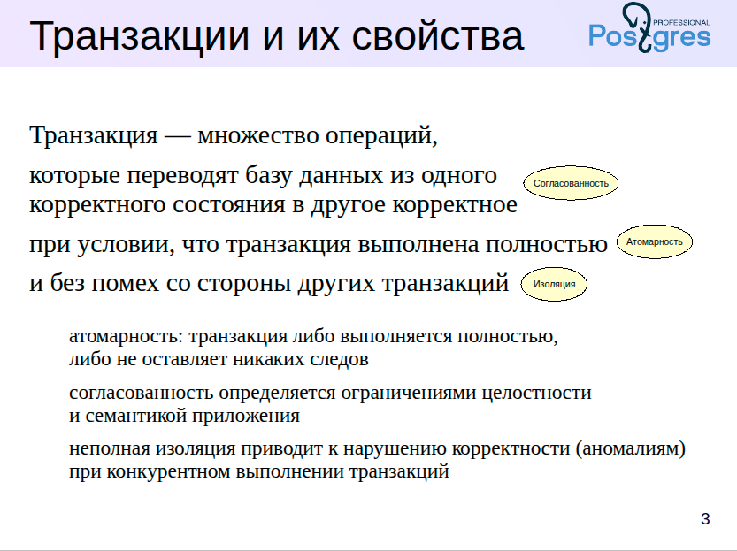
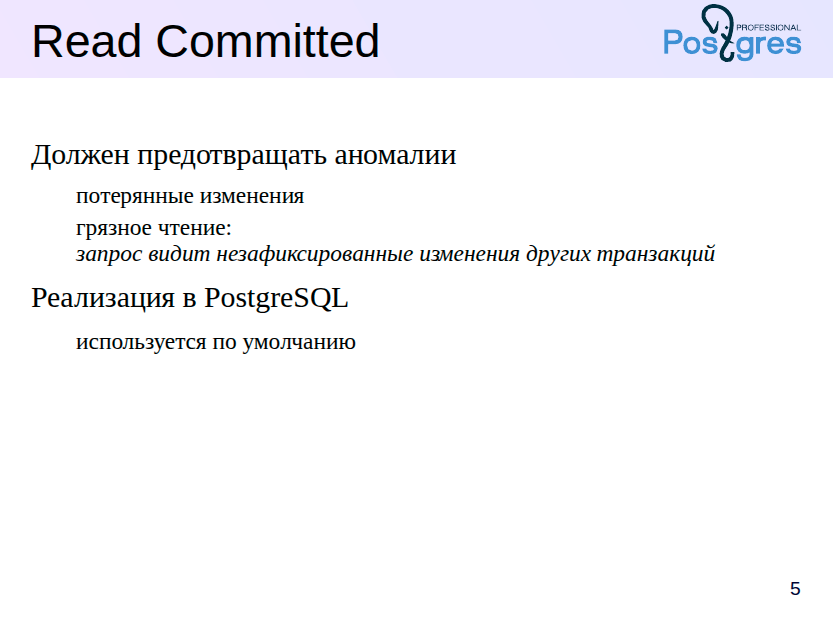
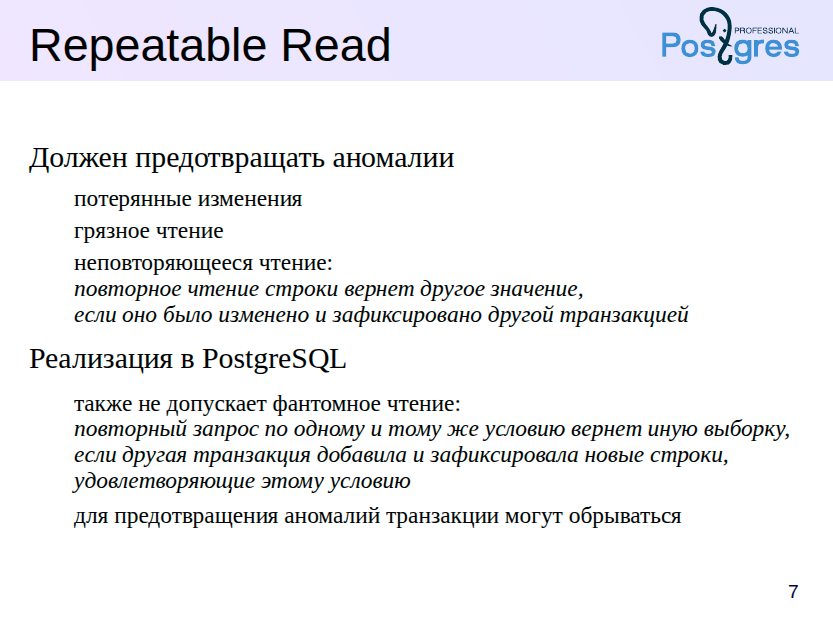
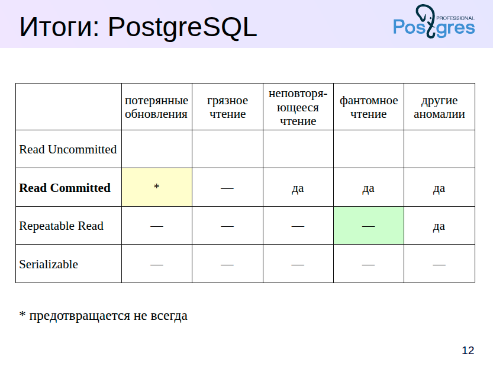
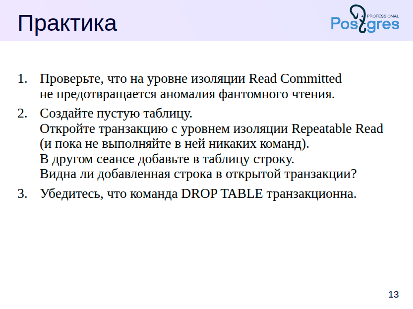

Когда мы говорим о **транзакции**, мы имеем в виду набор операций, которые приложение выполняет над базой данных, чтобы перевести её из одного **корректного состояния** в другое.

Что значит *корректное состояние*? Это состояние, которое удовлетворяет всем **ограничениям целостности** — как тем, что заданы в базе данных, так и тем, что определяются логикой самого приложения.

Чтобы изменения, которые вносит транзакция, считались корректными, важно, чтобы были соблюдены **три свойства**:

* **Атомарность** — либо выполняется вся транзакция целиком, либо не выполняется ничего;
* **Согласованность** — база данных остаётся в корректном состоянии;
* **Изоляция** — транзакции не мешают друг другу.


Рассмотрим принципы **ACID** на простом и понятном примере – **переводе денег с одного банковского счёта на другой**.

---

### 💳 Сценарий:

Клиент переводит **1000 рублей** со счёта А на счёт B.

---

### 🔹 A — *Атомарность*

Операция должна выполниться **целиком или не выполниться вовсе**.
Например, если 1000 рублей списались со счёта А, но из-за сбоя не были зачислены на счёт B — система должна отменить весь перевод.

**Просто: либо оба действия, либо ни одного.**

---

### 🔹 C — *Согласованность*

После выполнения транзакции все ограничения системы должны сохраняться.
Например, **общее количество денег в системе до и после перевода одинаково** — деньги не "пропали" и не "появились из воздуха".

---

### 🔹 I — *Изоляция*

Если в то же самое время выполняется другая транзакция, она **не должна мешать** текущей.
Допустим, клиент B пытается вывести деньги со своего счёта во время зачисления. Система должна обеспечить, чтобы **он не получил доступ к ещё не поступившим деньгам**.

---

### 🔹 D — *Долговечность*

После того как система сообщила, что перевод завершён успешно — **данные сохраняются даже при сбое**.
Даже если сервер "упал", после перезапуска перевод **не исчезнет**.

---


Особенно важно свойство изоляции. В идеале — если бы транзакция выполнялась в полном одиночестве — результат её работы не зависел бы от других параллельных транзакций. Но на практике изоляция часто **ослабляется**, чтобы повысить производительность. Это может привести к так называемым **аномалиям** — ситуациям, когда результат оказывается некорректным именно из-за взаимодействия с другими транзакциями.

Полная изоляция — это дорого и сложно. Поэтому важно **понимать, какие риски мы берём на себя**, снижая уровень изоляции.

О последнем свойстве — **долговечности (durability)** — мы поговорим позже, когда будем обсуждать **журналирование**.


**SQL-стандарт определяет четыре уровня изоляции транзакций**, и каждый из них допускает или предотвращает определённые аномалии при параллельной работе.

**Самый слабый уровень — Read Uncommitted**. Как видно из названия, на этом уровне транзакция может *видеть даже незафиксированные данные других транзакций*. Это может привести к множеству проблем.

Однако, согласно стандарту, даже на этом уровне должна быть предотвращена одна ключевая аномалия — **потерянные изменения** (*lost updates*). Что это значит? Допустим, транзакция T1 начала работать с данными. Параллельно другая транзакция T2 изменила эти же данные и успела их зафиксировать. Если T1 потом "перезапишет" эти данные, не заметив изменений T2 — это и есть потерянное изменение.

Именно эту ситуацию стандарт требует исключать даже на уровне Read Uncommitted.

Но есть важный практический момент:
**PostgreSQL вообще не реализует уровень Read Uncommitted**. Причина проста — даже без потерь в производительности PostgreSQL может работать на более строгих уровнях. Поэтому об этом уровне мы подробно говорить не будем.

---



Каждый уровень изоляции транзакций в SQL стандарте усиливает требования к консистентности данных. После уровня *Read Uncommitted*, следующий — *Read Committed* — должен предотвращать не только потерю изменений (*lost updates*), но и так называемое «грязное чтение» (*dirty read*).

Пример: если транзакция T1 читает строку, изменённую, но ещё не зафиксированную транзакцией T2, а затем T2 делает *ROLLBACK*, получается, что T1 использовала данные, которых на самом деле никогда не существовало.

Однако, даже при этом уровне изоляции возможны другие аномалии, поэтому важно понимать: *Read Committed* — это компромисс. В PostgreSQL он выбран по умолчанию, потому что обеспечивает хорошую производительность при приемлемом уровне надёжности.

Важно подчеркнуть, что в PostgreSQL даже на этом уровне возможны потери изменений. Мы покажем соответствующий пример в демонстрации.

---

# Управление уровнем изоляции

Для демонстрации мы будем использовать отдельную базу данных для каждой темы.

```sql
=> CREATE DATABASE arch_isolation;
CREATE DATABASE
=> \c arch_isolation
You are now connected to database "arch_isolation" as user "student".
````

Уровни изоляции рассмотрим на примере таблицы, представляющей состояние пешеходного светофора с двумя лампочками:

```sql
=> CREATE TABLE lights(
  id integer GENERATED ALWAYS AS IDENTITY,
  lamp text,
  state text
);
CREATE TABLE

-- Это будет пешеходный светофор с двумя лампочками:

=> INSERT INTO lights(lamp,state) VALUES
    ('red', 'on'), ('green', 'off');
INSERT 0 2

=> SELECT * FROM lights ORDER BY id;
 id | lamp  | state 
----+-------+-------
  1 | red   | on
  2 | green | off
(2 rows)
```

Один из способов установить уровень изоляции — команда `SET TRANSACTION`, выполненная в начале транзакции:

```sql
=> BEGIN;
BEGIN
=> SET TRANSACTION ISOLATION LEVEL READ COMMITTED;
SET

-- Проверить текущий уровень можно, посмотрев значение параметра:

=> SHOW transaction_isolation;
 transaction_isolation 
-----------------------
 read committed
(1 row)

=> COMMIT;
COMMIT
```

Можно указать уровень изоляции прямо в команде `BEGIN`:

```sql
=> BEGIN ISOLATION LEVEL READ COMMITTED;
BEGIN
=> COMMIT;
COMMIT
```

По умолчанию используется уровень `Read Committed`:

```sql
=> SHOW default_transaction_isolation;
 default_transaction_isolation 
-------------------------------
 read committed
(1 row)
```

Если параметр не менялся, можно не указывать уровень явно.

---

## Read Committed и грязное чтение

Попробуем прочитать «грязные» данные. В первой транзакции гасим красный свет:

```sql
=> BEGIN;
BEGIN
=> UPDATE lights SET state = 'off' WHERE lamp = 'red';
UPDATE 1
```

Начинаем второй сеанс:

```shell
student$ psql arch_isolation
```

В нем откроем ещё одну транзакцию с тем же уровнем `Read Committed`:

```sql
| => BEGIN;
| BEGIN
| => SELECT * FROM lights ORDER BY id;
|  id | lamp  | state 
| ----+-------+-------
|   1 | red   | on
|   2 | green | off
| (2 rows)
```

Вторая транзакция **не видит** незафиксированных изменений.

Отменим изменение:

```sql
=> ROLLBACK;
ROLLBACK
| => ROLLBACK;
| ROLLBACK
```

---

## Read Committed и чтение зафиксированных изменений

Проверим, что произойдет после фиксации изменений.

Первая транзакция:

```sql
=> BEGIN;
BEGIN
=> UPDATE lights SET state = 'off' WHERE lamp = 'red';
UPDATE 1
```

Вторая транзакция:

```sql
| => BEGIN;
| BEGIN
| => SELECT * FROM lights ORDER BY id;
|  id | lamp  | state 
| ----+-------+-------
|   1 | red   | on
|   2 | green | off
| (2 rows)
```

Пока изменений не видно.

Первая транзакция:

```sql
=> COMMIT;
COMMIT
```

Теперь во второй транзакции:

```sql
| => SELECT * FROM lights ORDER BY id;
|  id | lamp  | state 
| ----+-------+-------
|   1 | red   | off
|   2 | green | off
| (2 rows)

| => COMMIT;
| COMMIT
```

В режиме `Read Committed` операторы одной транзакции видят **только зафиксированные** изменения других транзакций.

---

## Важный момент

В рамках одной транзакции один и тот же запрос может вернуть разные результаты.

Если запрос выполняется долго, и за это время другая транзакция фиксирует изменения — они **не будут видны** внутри текущего оператора, но могут быть видны в следующем операторе.

Пример с задержкой:

```sql
=> SELECT *, pg_sleep(2) FROM lights ORDER BY id;
```

Пока этот запрос выполняется, во втором сеансе:

```sql
| => UPDATE lights SET state = 'on';
| UPDATE 2
```

| id | lamp  | state | pg_sleep |
|----|-------|-------|----------|
| 1  | red   | off   |          |
| 2  | green | off   |          |

(2 rows)


Итак, если во время выполнения оператора другая транзакция успела зафиксировать изменения, то они не будут видны. 

Оператор видит данные в таком состоянии, в котором они находились на момент начала его выполнения.


---

## Вызов volatile-функции в запросе

Если в запросе вызывается функция с категорией изменчивости `volatile`, которая внутри себя делает запрос, данные из функции могут быть несогласованными.

Пример:

```sql
=> CREATE FUNCTION get_state(lamp text) RETURNS text
LANGUAGE sql VOLATILE
RETURN (SELECT l.state FROM lights l WHERE l.lamp = get_state.lamp);
CREATE FUNCTION

--Повторим эксперимент, но теперь запрос будет использовать функцию:


=> SELECT *, get_state(lamp), pg_sleep(2) FROM lights ORDER BY id;
=> UPDATE lights SET state = 'off';
UPDATE 2

 id | lamp  | state | get_state | pg_sleep 
----+-------+-------+-----------+----------
  1 | red   | on    | on        | 
  2 | green | on    | off       | 
(2 rows)
```

Решение — объявить функцию как `STABLE`:

```sql
=> ALTER FUNCTION get_state STABLE;
ALTER FUNCTION

=> SELECT *, get_state(lamp), pg_sleep(2) FROM lights ORDER BY id;
=> UPDATE lights SET state = 'on';
UPDATE 2

 id | lamp  | state | get_state | pg_sleep 
----+-------+-------+-----------+----------
  1 | red   | off   | off       | 
  2 | green | off   | off       | 
(2 rows)
```

Вывод: внимательно следите за категорией изменчивости функций на уровне изоляции `Read Committed`. Значения по умолчанию могут приводить к несогласованным данным.

---

## Read Committed и потерянные изменения

Что происходит, если две транзакции пытаются изменить одну и ту же строку?

Все лампочки включены:

Первая транзакция выключает красную лампочку, но пока не завершается.:

```sql
=> BEGIN;
BEGIN
=> UPDATE lights SET state = 'off' WHERE lamp = 'red';
UPDATE 1
```

Вторая транзакция видит, что обе лампочки горят...:

```sql
| => BEGIN;
| BEGIN
| => SELECT * FROM lights;
|  id | lamp  | state 
| ----+-------+-------
|   2 | green | on
|   1 | red   | on
| (2 rows)

-- ... меняет состояние каждой лампочки...

| => UPDATE lights
| SET state = CASE WHEN state = 'on' THEN 'off' ELSE 'on' END;
```

\| но зависает, ожидая завершения первой.

Первая транзакция:

```sql
=> COMMIT;
COMMIT
```

\| Вторая транзакция продолжает:

```sql
UPDATE 2
```

По окончании первой транзакции вторая смогла изменить данные, и мы ожидаем, что во втором сеансе обе лампочки будут выключены.
Ожидаем, что обе лампочки будут выключены.

Проверим:

```sql
=> COMMIT;
COMMIT
=> SELECT * FROM lights;
 id | lamp  | state 
----+-------+-------
  2 | green | off
  1 | red   | on
(2 rows)
```

Почему красная лампочка снова **включена**?

Объяснение:

Команда UPDATE во второй транзакции блокирует строки таблицы по очереди. Сначала блокируется зеленая лампочка и изменяется ее состояние, а затем команда ждет снятия блокировки красной лампочки первой транзакцией.

При этом команда во второй транзакции не должна видеть изменений, сделанных после начала ее выполнения. С другой стороны, она не должна потерять изменения, зафиксированные другими транзакциями. Поэтому после снятия блокировки она перечитывает строку, которую пытается обновить.

В итоге, первая транзакция выключает красную лампочку, а вторая снова включает ее.

В результате вторая транзакция отработала успешно за счет того, что она видела несогласованные данные: часть — на один момент времени, часть — на другой.

Это и есть **потерянные изменения**.

---
Но если изменение выполняется не в одной команде SQL, то обновление будет потеряно.


## Потерянные изменения при нескольких командах

Пример, когда изменения полностью теряются:

Первая транзакция:

```sql
=> BEGIN;
BEGIN
-- Первая транзакция переводит красную лампочку в мигающий режим. Строка при этом блокируется:
=> UPDATE lights SET state = 'blink' WHERE lamp = 'red';
UPDATE 1
```

Во второй транзакции клиент видит, что красная лампочка горит...

```sql
=> BEGIN;
BEGIN
=> SELECT state AS old_state FROM lights WHERE lamp = 'red';
 old_state 
-----------
 on
(1 row)
... и выключает ее:
=> \bind off
=> UPDATE lights SET state = 'off' WHERE lamp = 'red';
```

Вторая транзакция ждет завершения первой.

Первая транзакция:

```sql
=> COMMIT;
COMMIT
```

Вторая транзакция:

```sql
| => COMMIT;
| COMMIT
```

Первый сеанс ожидает увидеть, что красная лампочка мигает. Проверим:

```sql
=> SELECT * FROM lights WHERE lamp = 'red';
 id | lamp | state 
----+------+-------
  1 | red  | off
(1 row)
```

В этом случае вторая транзакция записала свои изменения «поверх» изменений первой транзакции. На уровне Read Committed сервер не может это предотвратить, поскольку команда UPDATE фактически содержит предопределенную константу.

Вторая транзакция записала свои изменения поверх первой. На уровне `Read Committed` сервер не может этого предотвратить, так как команда `UPDATE` с предопределенной константой не обнаруживает конфликт.

---

# Итог

* Уровень `Read Committed` предотвращает грязное чтение, но допускает потерянные изменения.
* Поведение транзакций в PostgreSQL на этом уровне — компромисс между изоляцией и производительностью.
* При работе с функциями важно правильно указывать категорию изменчивости.
* Для полной защиты от аномалий нужна более высокая изоляция, например, `Repeatable Read` или `Serializable`.

---





Согласно стандарту, в дополнение к потерянным изменениям и грязным чтениям уровень изоляции Repeatable Read должен предотвращать аномалию, которую мы видели, когда рассматривали уровень Read Committed:

● Неповторяющееся чтение (non-repeatable read). После того как транзакция T1 прочитала строку, транзакция T2 изменила или удалила эту строку и зафиксировала изменения (COMMIT). При повторном чтении этой же строки транзакция T1 видит, что строка изменена или удалена. Реализация PostgreSQL более строгая, чем того требует стандарт, и предотвращает аномалию.

● Фантомное чтение (phantom read). Транзакция T1 прочитала набор строк по некоторому условию. Затем транзакция T2 добавила строки, также удовлетворяющие этому условию. Если транзакция T1 повторит запрос, она получит другую выборку строк.

На самом деле существуют и другие аномалии (не отраженные в стандарте), которые допускаются в PostgreSQL на уровне Repeatable Read.

От уровня Read Committed этот уровень изоляции отличается и тем, что на нем транзакция может быть оборвана, чтобы не допустить аномалию (такую транзакцию надо повторять). На уровне Read Committed этого не происходит никогда — если стоит выбор между корректностью и эффективностью, предпочтение всегда отдается эффективности.


## Практика


# Repeatable Read и неповторяющееся чтение

Убедимся в отсутствии аномалии неповторяющегося чтения.

```sql
=> BEGIN ISOLATION LEVEL REPEATABLE READ;
BEGIN

=> SELECT * FROM lights WHERE lamp = 'red';
 id | lamp | state 
----+------+-------
  1 | red  | off
(1 row)

| => UPDATE lights SET state = 'on' WHERE lamp = 'red' RETURNING *;
|  id | lamp | state 
| ----+------+-------
|   1 | red  | on
| (1 row)
| 
| UPDATE 1
````

Какое значение получит теперь первая транзакция?

```sql
=> SELECT * FROM lights WHERE lamp = 'red';
 id | lamp | state 
----+------+-------
  1 | red  | off
(1 row)

=> COMMIT;
COMMIT
```

Повторное чтение измененной строки возвращает первоначальное значение.

---

# Repeatable Read и фантомное чтение

Фантомные записи также не должны быть видны. Проверим это.

```sql
=> BEGIN ISOLATION LEVEL REPEATABLE READ;
BEGIN

=> SELECT * FROM lights WHERE state = 'off';
 id | lamp  | state 
----+-------+-------
  2 | green | off
(1 row)

| => INSERT INTO lights(lamp,state) VALUES ('yellow', 'off') 
|     RETURNING *;
|  id |  lamp  | state 
| ----+--------+-------
|   3 | yellow | off
| (1 row)
| 
| INSERT 0 1

=> SELECT * FROM lights WHERE state = 'off';
 id | lamp  | state 
----+-------+-------
  2 | green | off
(1 row)

Действительно, транзакция не видит добавленной записи, удовлетворяющей первоначальному условию. Уровень изоляции Repeatable Read в PostgreSQL более строгий, чем того требует стандарт SQL.

=> COMMIT;
COMMIT
```

Уберем желтую лампочку.

```sql
=> DELETE FROM lights WHERE lamp = 'yellow';
DELETE 1
```

---

# Repeatable Read и потерянные изменения

Необходимость все время видеть ровно те же данные, что и в самом начале, не позволяет перечитывать измененную строку в случае обновления.

Воспроизведем тот же пример, который мы видели на уровне изоляции Read Committed. Сейчас все лампочки включены.

```sql
| => BEGIN;
| BEGIN
| 
| => UPDATE lights SET state = 'blink' WHERE lamp = 'red';
| UPDATE 1
| 
| => BEGIN ISOLATION LEVEL REPEATABLE READ;
| BEGIN
| 
| => SELECT state AS current_state FROM lights WHERE lamp = 'red';
|  current_state 
| ---------------
|  on
| (1 row)
| 
| => \bind off
| 
| => UPDATE lights SET state = $1 WHERE lamp = 'red';
```

Вторая транзакция ждет завершения первой.

```sql
=> COMMIT;
COMMIT

| ERROR:  could not serialize access due to concurrent update

| => ROLLBACK;
| ROLLBACK
```

Таким образом, потерянное обновление на уровне Repeatable Read не допускается.

---

# Repeatable Read и другие аномалии

Можно ли быть уверенным в том, что следующая команда включит все лампочки?

```sql
UPDATE lights SET state = 'on' WHERE state != 'on';
```

Можно ли быть уверенным в том, что следующая команда выключит все лампочки?

```sql
UPDATE lights SET state = 'off' WHERE state != 'off';
```

Если одна транзакция включает лампочки, а другая — выключает, в каком состоянии останется таблица после одновременного выполнения двух этих транзакций?

Включим красную лампочку и проверим.

```sql
=> UPDATE lights SET state = 'on' WHERE lamp = 'red';
UPDATE 1
```

Начальное состояние:

```sql
=> SELECT * FROM lights ORDER BY id;
 id | lamp  | state 
----+-------+-------
  1 | red   | on
  2 | green | off
(2 rows)

=> BEGIN ISOLATION LEVEL REPEATABLE READ;
BEGIN

=> UPDATE lights SET state = 'on' WHERE state != 'on';
UPDATE 1

=> SELECT * FROM lights ORDER BY id;
 id | lamp  | state 
----+-------+-------
  1 | red   | on
  2 | green | on
(2 rows)

| => BEGIN ISOLATION LEVEL REPEATABLE READ;
| BEGIN

| => UPDATE lights SET state = 'off' WHERE state != 'off';
| UPDATE 1

| => SELECT * FROM lights ORDER BY id;
|  id | lamp  | state 
| ----+-------+-------
|   1 | red   | off
|   2 | green | off
| (2 rows)

=> COMMIT;
COMMIT

| => COMMIT;
| COMMIT
```

И оказывается, что...

```sql
=> SELECT * FROM lights ORDER BY id;
 id | lamp  | state 
----+-------+-------
  1 | red   | off
  2 | green | on
(2 rows)
```

...одна лампочка включена, а другая — выключена.

Это пример аномалии конкурентного доступа — **несогласованная запись (write skew)**, — которая возможна, даже если нет грязного, неповторяющегося и фантомного чтений.


Полное отсутствие каких бы то ни было аномалий достигается, если:
> Команды, выполняемые в конкурентно работающих транзакциях, приводят к такому же результату, какой получился бы в случае последовательного (одна завершилась → следующая началась) выполнения этих транзакций (при каком-нибудь порядке выполнения).

В PostgreSQL этот уровень реализован и работает, но **только если все транзакции в системе используют уровень Serializable**.

#### Ограничения реализации
1. **Не работает на репликах**
   - Запросы не могут выполняться на физических репликах
2. **Возможны ложные прерывания**
   - Транзакции могут обрываться чаще, чем это действительно необходимо
   - Снижается эффективность, так как оборванные транзакции приходится выполнять повторно

## ПРАКТИКА


# Уровень изоляции Serializable

```sql
-- Начало транзакции с уровнем изоляции Serializable
BEGIN ISOLATION LEVEL SERIALIZABLE;

-- Первая транзакция включает все выключенные лампочки
UPDATE lights SET state = 'on' WHERE state != 'on';
-- Результат: UPDATE 1

-- Проверка состояния лампочек в первой транзакции
SELECT * FROM lights ORDER BY id;
```
Результат первой транзакции:
```
 id | lamp  | state 
----+-------+-------
  1 | red   | on
  2 | green | on
(2 rows)
```

Вторая транзакция не видит незафиксированных изменений: для нее красный свет еще выключен, и она выключает зеленый.

```sql
| -- Вторая транзакция (параллельная) также начинается с Serializable
| BEGIN ISOLATION LEVEL SERIALIZABLE;
| 
| -- Она пытается выключить все включенные лампочки
| UPDATE lights SET state = 'off' WHERE state != 'off';
| -- Результат: UPDATE 1
| 
| -- Проверка состояния лампочек во второй транзакции
| SELECT * FROM lights ORDER BY id;
```
Результат второй транзакции:
Для второй транзакции обе лампочки выключены:
```
 id | lamp  | state 
----+-------+-------
  1 | red   | off
  2 | green | off
(2 rows)
```

```sql
-- Попытка зафиксировать изменения
COMMIT;  -- Первая транзакция успешно коммитится
| COMMIT;  -- Вторая транзакция получает ошибку
```
Ошибка второй транзакции:
```
| ERROR:  could not serialize access due to read/write dependencies among transactions
| DETAIL:  Reason code: Canceled on identification as a pivot, during commit attempt.
| HINT:  The transaction might succeed if retried.
 ```

## И вторая транзакция получает ошибку.

При последовательном выполнении возможны два варианта:
1. Если сначала выполняется первая транзакция, а потом вторая - все лампочки выключаются
2. Если сначала выполняется вторая транзакция, а потом первая - все лампочки включаются

Промежуточное состояние невозможно, поэтому PostgreSQL прерывает одну из транзакций.

## Важное замечание

Для корректной работы уровня Serializable **все транзакции** в системе должны использовать этот уровень изоляции. Если смешивать транзакции разных уровней, Serializable будет вести себя как Repeatable Read.


Подытожим информацию.

В стандарте SQL определены четыре уровня изоляции транзакций:Read Uncommitted, Read Committed, Repeatable Read, Serializable(по умолчанию).

Таблица показывает соответствие между уровнями изоляции и теми аномалиями, которые они могут допускать.Отметим, что для обеспечения уровня изоляции Serializable недостаточно исключить три аномалии, определенные в стандарте




> Реальные СУБД, включая PostgreSQL, не следуют стандарту изоляции транзакций буквально. Стандарт формулировался ещё до того, как вопросы изоляции получили полноценное теоретическое обоснование.
>
> Названия уровней изоляции сохранились, но **реализация в PostgreSQL зачастую строже, чем требует стандарт**.
>
> PostgreSQL использует **изоляцию на основе снимков (Snapshot Isolation)** и **многоверсионность (MVCC)**, что определяет следующие свойства:
>
> * **Грязное чтение (Dirty Read)** полностью исключено — и это достигается без потерь в производительности.
>
> * **Read Committed** — уровень изоляции по умолчанию. Он используется во многих СУБД и часто требует ручной установки блокировок для корректности данных.
>
> * **Repeatable Read** — не допускает ни неповторяемого чтения, ни фантомов. Хотя это не полноценная сериализация, данный уровень удобен, например, для отчетов: он гарантирует согласованность данных при серии запросов и не прерывает только-читающие транзакции.
>
> * **Serializable** — реализован полностью, но с определёнными ограничениями и накладными расходами.
>
> Подробнее — в официальной документации:
> [https://postgrespro.ru/docs/postgresql/16/transaction-iso](https://postgrespro.ru/docs/postgresql/16/transaction-iso)

---




