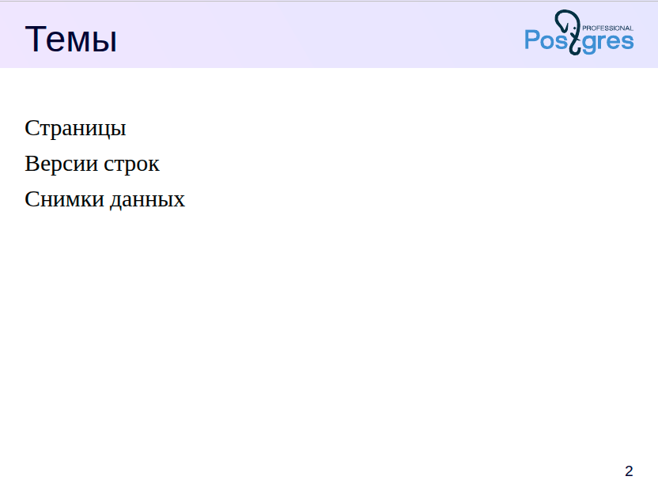


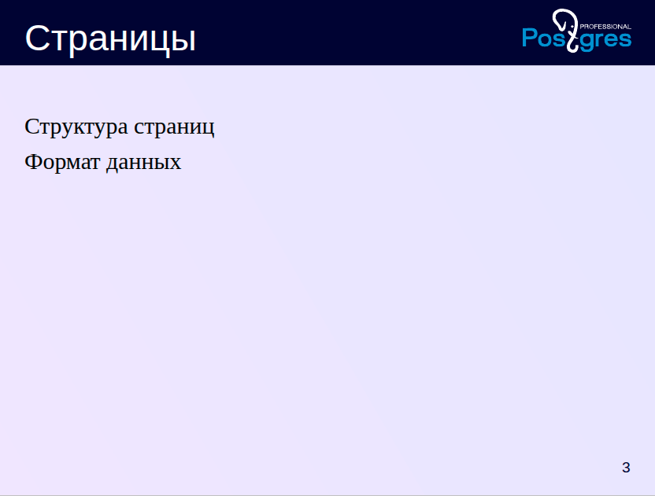


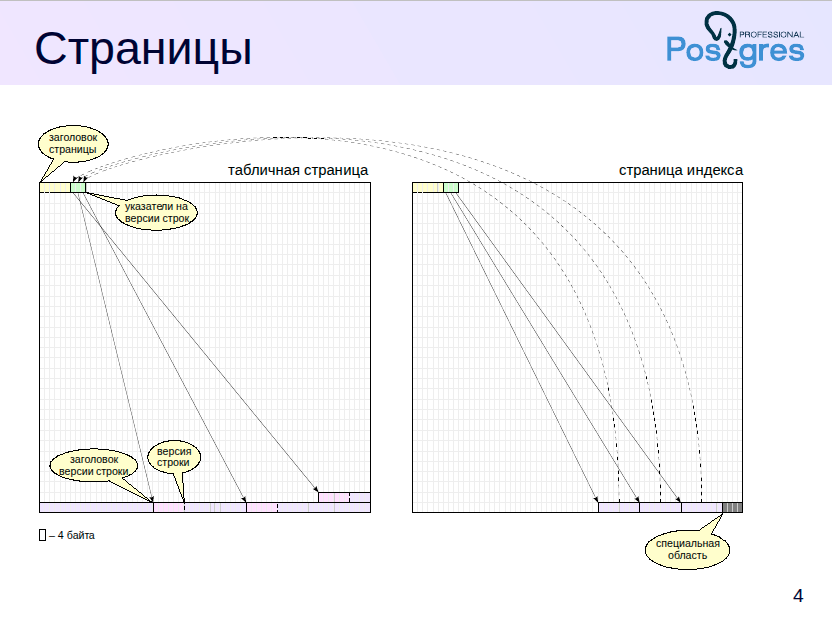


---

### 📚 Структура страницы хранения в PostgreSQL

Размер страницы в PostgreSQL по умолчанию составляет **8 килобайт**. Это значение можно увеличить — **до 32 КБ**, — но **только при сборке сервера**, то есть на этапе компиляции исходного кода.

Все основные объекты хранения — **таблицы, индексы и другие объекты**, которые PostgreSQL объединяет общим термином **relation** — используют **одинаковую структуру страниц**. Это важно: **единый формат** позволяет использовать **общий буферный кэш**, что упрощает архитектуру и повышает эффективность работы с памятью.

---

### 🔍 Структура страницы

Каждая страница начинается с **заголовка** объёмом **24 байта**. В нём хранится общая информация:

* Служебные флаги;
* Смещения областей данных;
* Информация о свободном пространстве;
* Размеры ключевых зон страницы.

---

### 📦 Основные компоненты страницы:

1. **Массив указателей (ItemIdData)**

   * Каждый указатель имеет **фиксированный размер — 4 байта**.
   * Эти указатели образуют массив, через который PostgreSQL получает доступ к хранимым строкам.
   * Позиция указателя в массиве определяет **tuple ID** — `tid`, который используется, например, в индексах.
   * Указатели **ссылаются на реальные строки**, расположенные **в конце страницы**.

2. **Версии строк (tuples)**

   * Это сами **данные**, которые мы храним в таблицах.
   * Каждая строка сопровождается **заголовком**, содержащим метаинформацию: время создания, информацию для MVCC, флаги и пр.
   * В терминах PostgreSQL строка называется **tuple** (тюпл). Иногда её так и называют — «версия строки».

3. **Свободное пространство (Free Space)**

   * Располагается между указателями и строками.
   * Используется при вставках и обновлениях: PostgreSQL старается разместить новые версии строк **в пределах той же страницы**, если позволяет свободное место.
   * Это снижает фрагментацию и улучшает производительность.

4. **Специальная область (Special Space)**

   * Находится в самом конце страницы.
   * Используется **некоторыми типами индексов**, например, GiST и GIN, для хранения служебных структур.
   * В таблицах и B-деревьях (B-Tree) эта область обычно не используется.

5. **Нулевая страница (Page 0)**

   * В некоторых случаях используется для **служебных целей** — например, в системных каталогах или специальных индексах.

---

### 🧠 Почему такая организация?

* **Косвенная адресация** (через массив указателей) удобна:

  * Не нужно сканировать всю страницу — достаточно перейти по нужному `tid`.
  * Можно **перемещать строки внутри страницы** (например, при сжатии или дефрагментации) — **не нарушая ссылок в индексах**.

* Такой подход помогает PostgreSQL эффективно работать даже при высоких нагрузках и активном обновлении данных.

---

📎 *Подробнее — в официальной документации:*
[https://postgrespro.ru/docs/postgresql/16/storage-page-layout](https://postgrespro.ru/docs/postgresql/16/storage-page-layout)

---


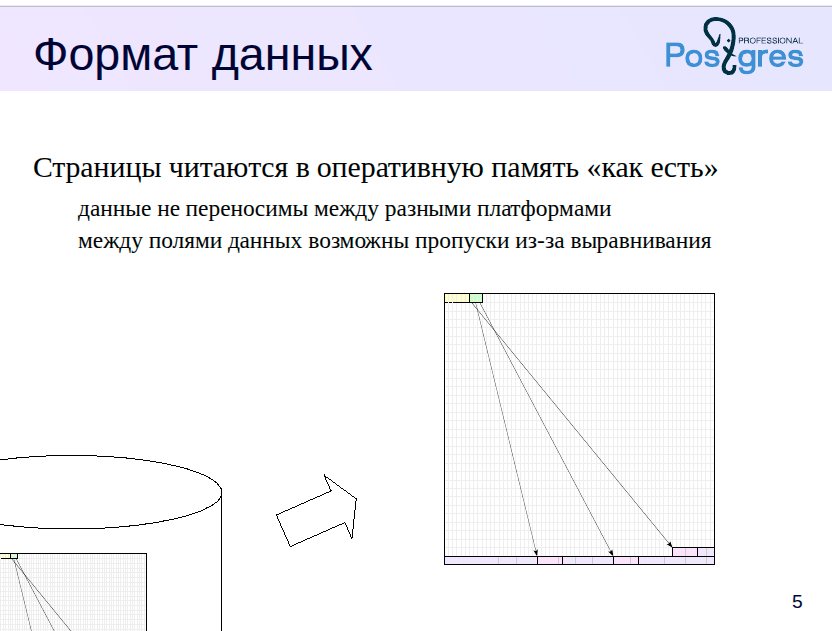


### 📐 Выравнивание данных в памяти и его влияние на размер строк

Во многих архитектурах компьютеров, в том числе в x86 и x86\_64, **предусмотрено выравнивание данных по границам машинных слов**. Это требование связано как с производительностью, так и с архитектурными особенностями CPU.

#### 🔹 Что это значит?

* На **32-битной системе** (например, x86):

  * Значения типа `integer` (4 байта) выравниваются по **4-байтным границам**.
  * Значения типа `double precision` (8 байт) также выравниваются по **4-байтным границам**, но будут занимать **две такие границы подряд**.

* На **64-битной системе** (x86\_64):

  * Значения `double precision` будут уже выравниваться по **8-байтным границам**, в соответствии с шириной машинного слова.

Это означает, что при размещении данных в памяти между некоторыми полями могут появляться **заполнители — padding-байты**, которые не содержат полезной информации, но необходимы для корректной работы процессора.

---

### 📏 Как это влияет на строки таблиц в PostgreSQL?

Размер строки в таблице зависит не только от **самих данных**, но и от **порядка следования полей**. Это важно учитывать при проектировании таблиц, особенно если вы работаете с большими объёмами данных.

#### 🔸 Пример:

Если в таблице чередуются поля:

```sql
char(1), integer, char(1), integer
```

То между `char(1)` и `integer` будет вставляться **по 3 байта выравнивания**, чтобы integer попадал на 4-байтную границу.

В результате:

* Каждое такое «вплетение» char+int потребует не 5 байт, а **8 байт**.
* На длинных строках или в больших таблицах это может **в два раза увеличить объём занимаемой памяти**.

---

### 💡 Рекомендация:

**Располагайте поля в порядке убывания их размера.**

Например:

```sql
double precision,
integer,
smallint,
char(1)
```

Такой порядок:

* Минимизирует необходимость во вставке пустых байтов,
* Позволяет сократить общий размер строки,
* Соответственно, увеличивает плотность хранения и эффективность работы кэша.

---

### ⚙️ PostgreSQL и выравнивание

PostgreSQL старается автоматически соблюдать требования по выравниванию. Однако:

* Он **не перепорядочивает поля** — это остаётся на совести разработчика.
* Поэтому **плохое проектирование схемы может привести к "раздуванию" строк**.

Особенно это важно при:

* Высокой частоте чтения/записи,
* Большом количестве строк,
* Таблицах, которые активно кэшируются.

---

📎 Подробно эта тема раскрыта в докладе:
[«Tuple Internals», PGConf.ru (PDF)](https://pgconf.ru/media/2016/05/13/tuple-internals-ru.pdf)

---


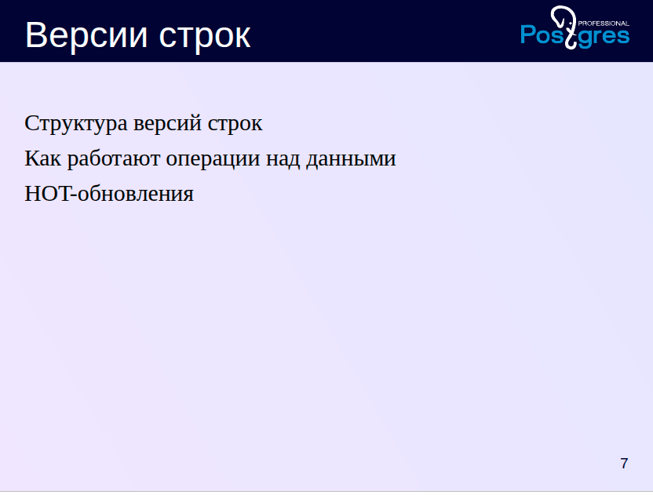


# 🧱 Структура страницы PostgreSQL с использованием `pageinspect`

## Подготовка

```sql
=> CREATE DATABASE arch_mvcc;
CREATE DATABASE
```

```sql
=> \c arch_mvcc
You are now connected to database "arch_mvcc" as user "student".
```

Создадим таблицу и индекс по одному из полей:

```sql
=> CREATE TABLE t(
  id integer,
  s text
);
CREATE TABLE
```

```sql
=> CREATE INDEX t_s on t(s);
CREATE INDEX
```

```sql
=> INSERT INTO t(id, s) VALUES (42, 'FOO');
INSERT 0 1
```

---

## 📖 Структура страницы

Чтобы изучить структуру страницы и версий строк, воспользуемся расширением `pageinspect`.

```sql
=> CREATE EXTENSION pageinspect;
CREATE EXTENSION
```

Посмотрим на поля заголовка страницы, определяющие границы её областей:

```sql
=> SELECT lower, upper, special, pagesize
FROM page_header(get_raw_page('t',0));
```

Результат:

```
 lower | upper | special | pagesize 
-------+-------+---------+----------
    28 |  8160 |    8192 |     8192
(1 row)
```

---

## 🧭 Области страницы

Области занимают следующие диапазоны адресов:

* `0` — начало заголовка страницы и указатели на версии строк
* `lower` — начало свободного места
* `upper` — начало данных (версий строк)
* `special` — начало специальных данных (только для индексов)
* `pagesize` — конец страницы

---


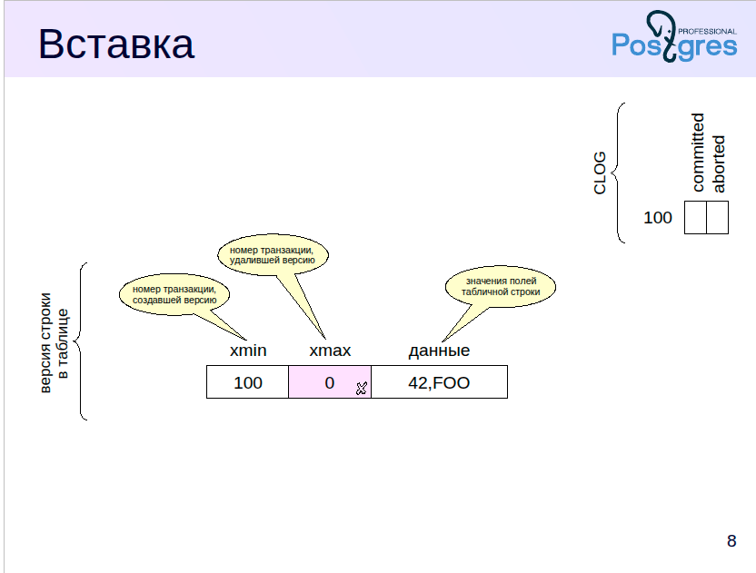


# Устройство версий строк (tuples) в PostgreSQL

Рассмотрим, как устроены версии строк (tuples) и как выполняются операции со строками на низком уровне.

Начнем со вставки.

В нашем примере — таблица с двумя столбцами (число и текст).
При вставке строки в табличной странице (heap page) появится указатель с номером 1, ссылающийся на первую и единственную версию строки.

Каждый такой указатель помимо ссылки содержит длину версии строки и несколько бит, определяющих ее статус.

---

## Заголовок версии строки

Версии строк кроме собственно данных имеют также заголовок, занимающий минимум 23 байта.
Помимо прочего он содержит:

* **xmin и xmax** — поля, определяющие видимость данной версии строки в терминах начального и конечного номеров транзакций;
* **Карту неопределенных значений** (в ней отмечены поля со значением `NULL`);
* **Ряд признаков**, показывающих, например, статус транзакций `xmin` и `xmax`, если он уже известен (зафиксированы или оборваны).

---

## Пример

В нашей версии строки поле `xmin` заполнено номером текущей транзакции (**100**).

Поскольку изменения еще не фиксировались и транзакция активна, то в журнале статуса транзакций (**CLOG**) соответствующая запись заполнена нулями.

CLOG можно представить себе как массив, в котором для каждой транзакции (начиная с некоторой) отводится ровно два бита.

Поле `xmax` заполнено фиктивным номером **0**.
Транзакции не будут обращать внимание на этот номер, поскольку установлен признак, что эта транзакция **оборвана**.

---

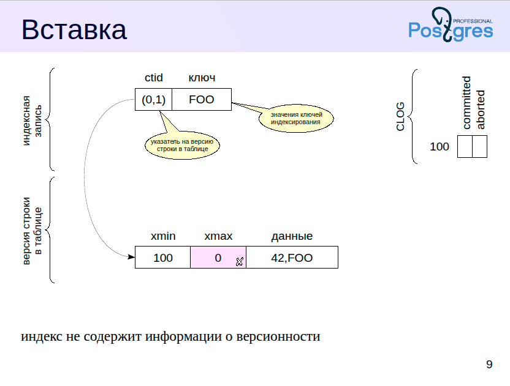


Вот ваш текст, оформленный в **формате Markdown** без изменения содержания:

---

## Индекс B-дерево и структура индексной страницы

Пусть также имеется индекс B-дерево, созданный по текстовому полю.
Информация в индексной странице сильно зависит от типа индекса.
И даже у одного типа индекса бывают разные виды страниц. Например, у B-дерева есть страница с метаданными, страницы для листовых и промежуточных узлов.

Тем не менее, обычно в странице имеется массив указателей и индексные записи (аналогичные версиям строк в табличной странице).

Индексные записи тоже могут иметь очень разную структуру в зависимости от типа индекса.
Например, для B-дерева записи в листовых страницах содержат значение ключа индексирования и ссылку (ctid) на соответствующую строку таблицы (структура B-дерева разбирается в теме «Классы операторов» и в учебном курсе QPT «Оптимизация запросов»).

В общем случае индекс может быть устроен совсем другим образом, но как правило он все равно будет содержать ссылки на версии строк.

В нашем примере в индексной странице также создается указатель с номером 1, который ссылается на индексную запись, которая, в свою очередь, ссылается на первую строку в табличной странице.
Чтобы не загромождать рисунок, указатель и строка таблицы объединены.

---

## Важный момент

Никакой индекс не содержит информацию о версионности (нет полей `xmin` и `xmax`).
Прочитав индексную запись, невозможно определить ее видимость, не заглянув в табличную страницу (для оптимизации служит карта видимости).

---


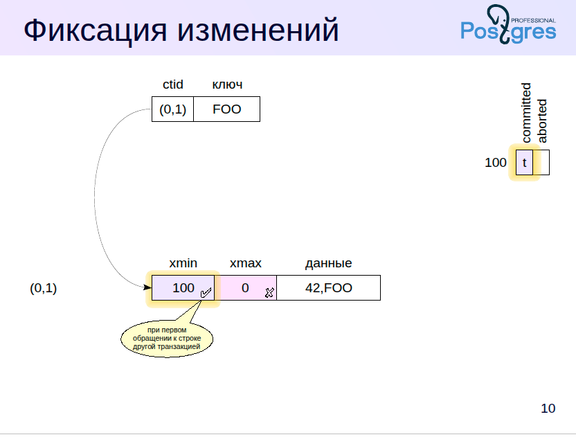


---

## Завершение транзакции и роль CLOG

Когда транзакция фиксируется, в **CLOG** для этой транзакции выставляется признак `committed`.
Это, по сути, единственная операция (не считая журнала предзаписи), которая необходима.

---

## Проверка статуса транзакции

Когда какая-либо другая транзакция обратится к версии строки, ей придется ответить на вопросы:

1. Завершилась ли транзакция 100
   (надо проверить список активных процессов и их транзакций; такая структура в общей памяти имеет название **ProcArray**),

2. А если завершилась, то фиксацией или отменой
   (свериться с **CLOG**).

Поскольку выполнять проверку по CLOG каждый раз накладно, выясненный однажды статус транзакции записывается в информационные **биты-подсказки заголовка строки**.

Если один из этих битов установлен, то состояние транзакции `xmin` считается известным, и следующей транзакции уже не придется обращаться к **CLOG**.

---

## Почему не вставляет сама транзакция?

Почему эти биты не устанавливаются той транзакцией, которая выполняла вставку?

* В момент, когда транзакция фиксируется или отменяется, уже непонятно, какие именно строки в каких именно страницах транзакция успела поменять.
* Кроме того, часть этих страниц может быть вытеснена из буферного кеша на диск.
* Читать их заново, чтобы изменить биты, означало бы существенно замедлить фиксацию.

---

## Обратная сторона

Обратная сторона состоит в том, что любая транзакция (даже выполняющая простое чтение — `SELECT`) может загрязнить данные в буферном кеше и породить новые журнальные записи.

---


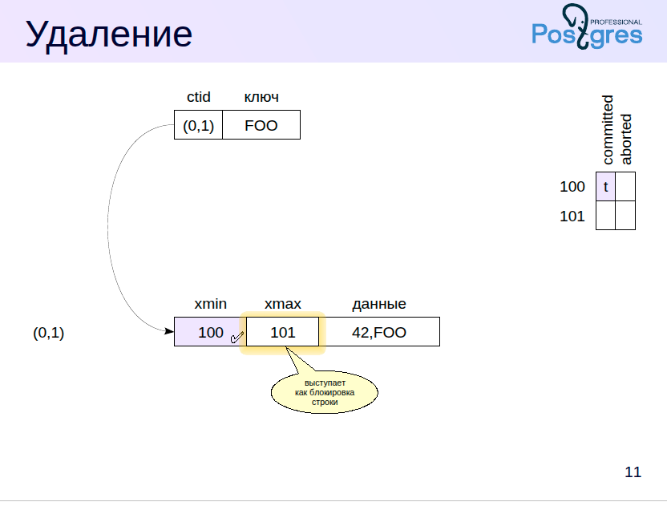


---

## Удаление строки и роль `xmax`

```
    11 xmax xmin данные
    100 42,FOO
    Удаление 100 committed aborted
    ctid ключ
    (0,1) FOO (0,1)
    t101 выступает как блокировка строки
```

---

При удалении строки в поле **xmax** текущей версии записывается номер текущей удаляющей транзакции, а признак оборванной транзакции сбрасывается.
Больше ничего не происходит.

---

## Блокировка при удалении

Заметим, что установленное значение `xmax`, соответствующее **активной транзакции** (что определяется другими транзакциями по **ProcArray**), выступает в качестве **блокировки**.

Если другая транзакция намерена **обновить или удалить** эту строку, она будет вынуждена дождаться завершения транзакции `xmax`.

---

## Дополнительно

Подробнее блокировки рассматриваются в теме **«Блокировки»** этого модуля.
Пока отметим только, что **число блокировок строк ничем не ограничено**.
Они не занимают место в оперативной памяти, и производительность системы не страдает от их количества (разумеется, за исключением того, что первый процесс, обратившийся к версии строки, должен будет проставить **биты-подсказки**).

---


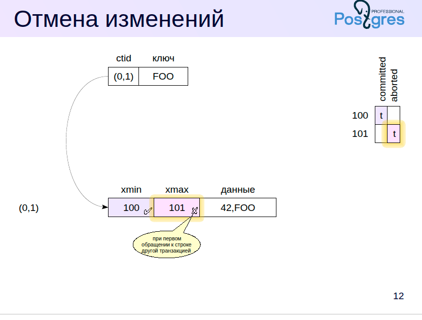


Вот ваш текст в формате Markdown, как вы просили — без изменений в содержании:

---

## Отмена изменений

```
    12 xmax xmin данные
    Отмена изменений
    100 42,FOO
    100 committed aborted
    ctid ключ
    (0,1) FOO (0,1)
    t101
    101 при первом обращении к строке другой транзакцией t
```

---

**Отмена изменений** работает аналогично **фиксации**, только в **CLOG** для транзакции выставляется **бит оборванной транзакции**.
Отмена выполняется так же быстро, как и фиксация — не требуется выполнять откат выполненных действий.

---

## Поведение после отмены

Номер прерванной транзакции остаётся в поле `xmax`.
Когда другая транзакция обратится к версии строки, она проверит статус транзакции `101` и установит в версию строки **признак-подсказку**, что транзакция **оборвана**.
Это будет означать, что на значение в поле `xmax` **смотреть не нужно**.

---


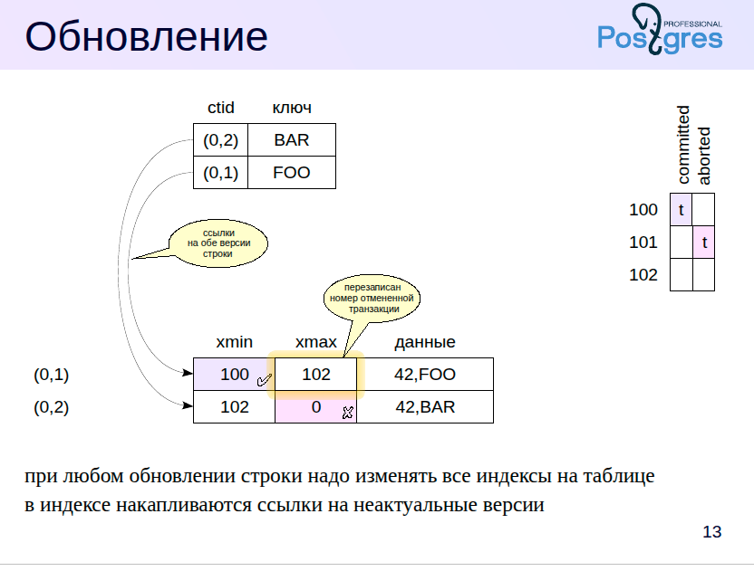


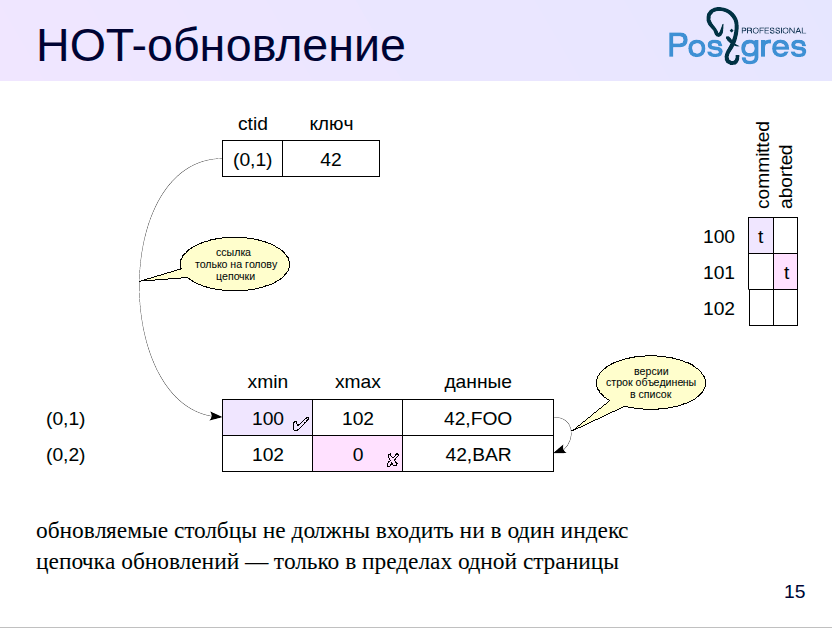


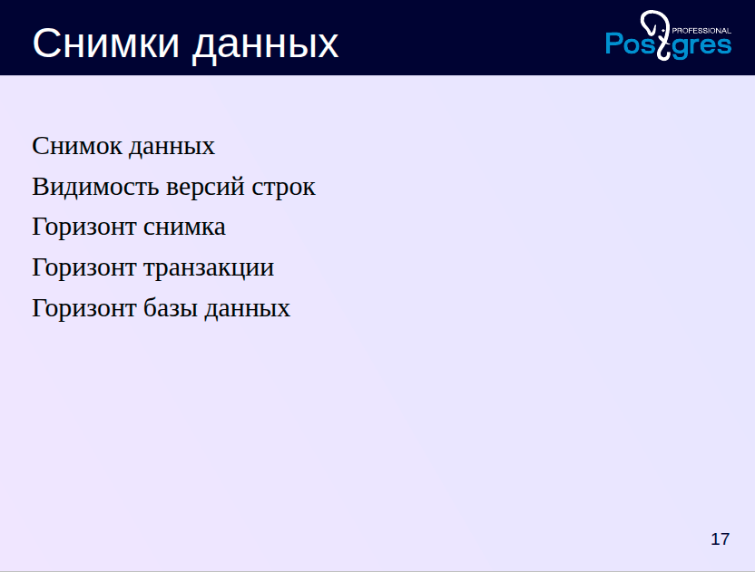


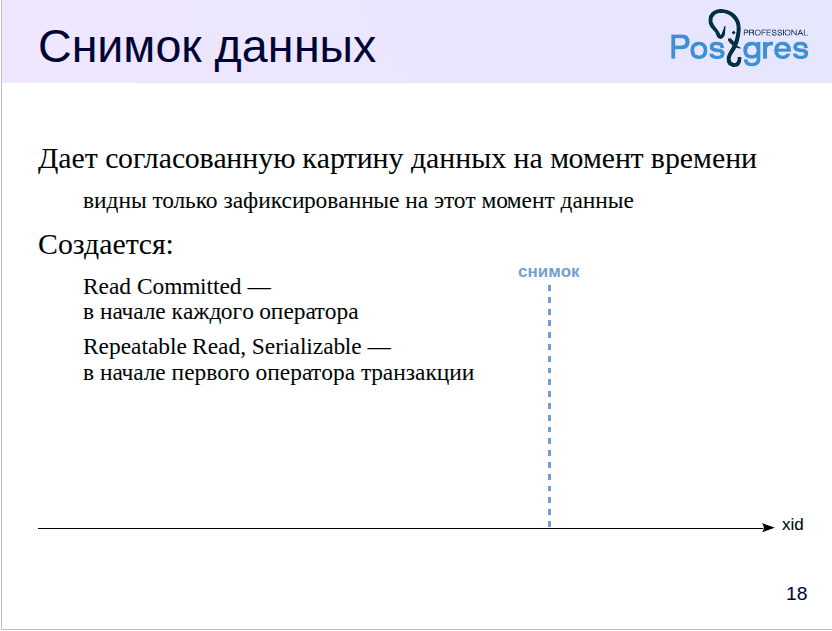


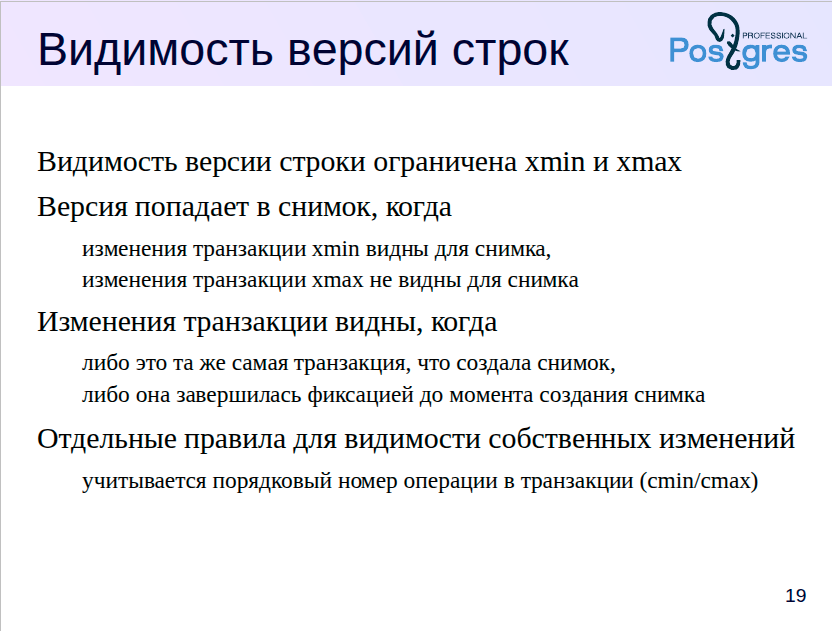


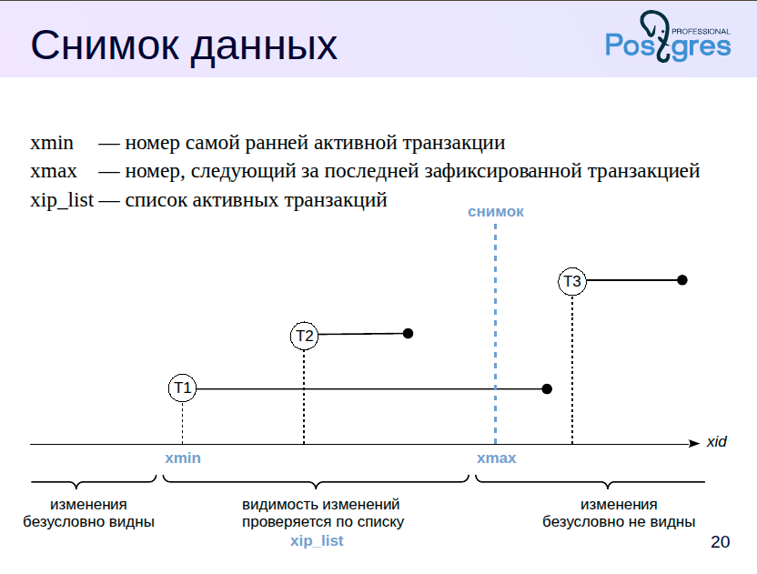


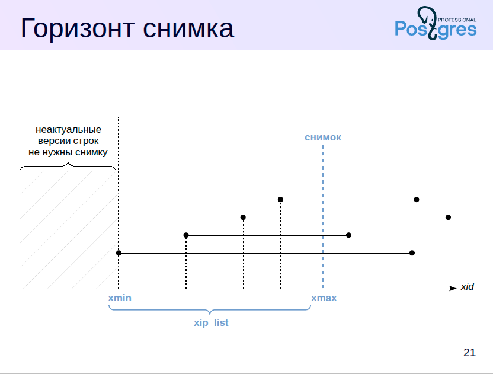


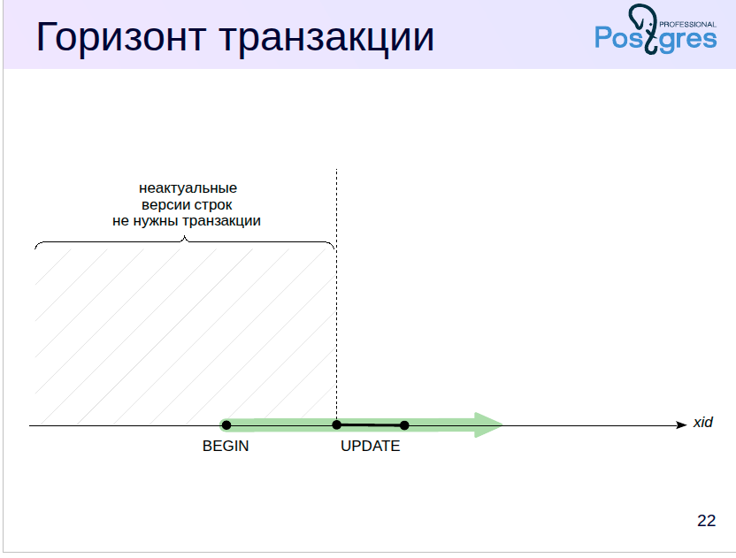


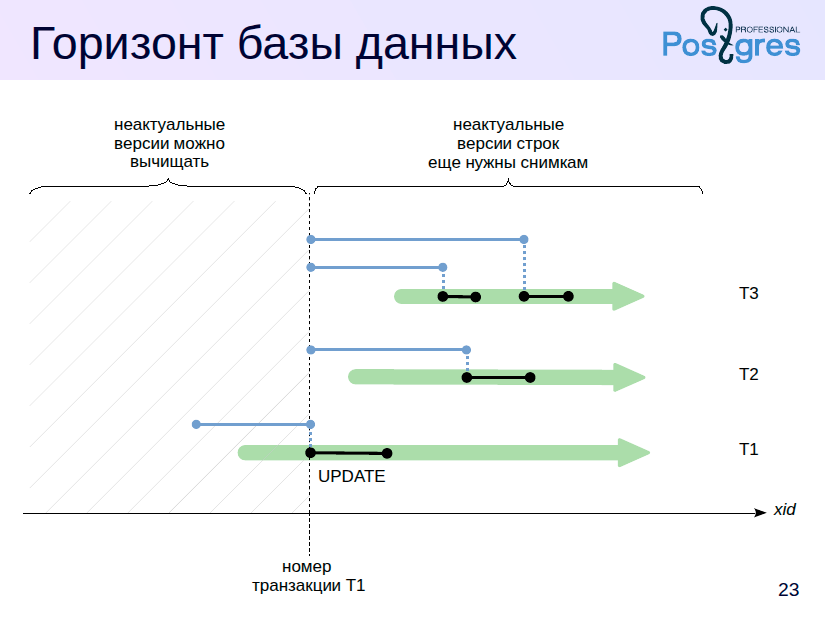


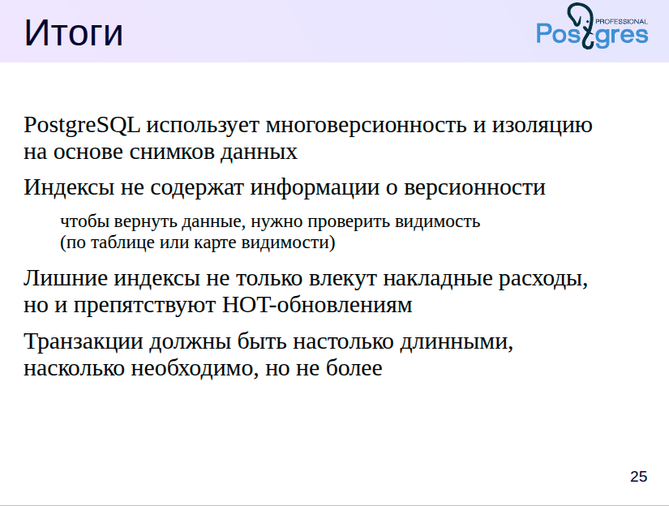


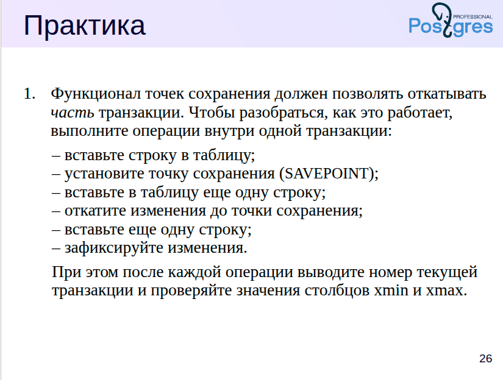
